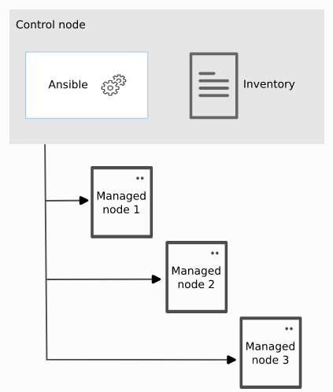
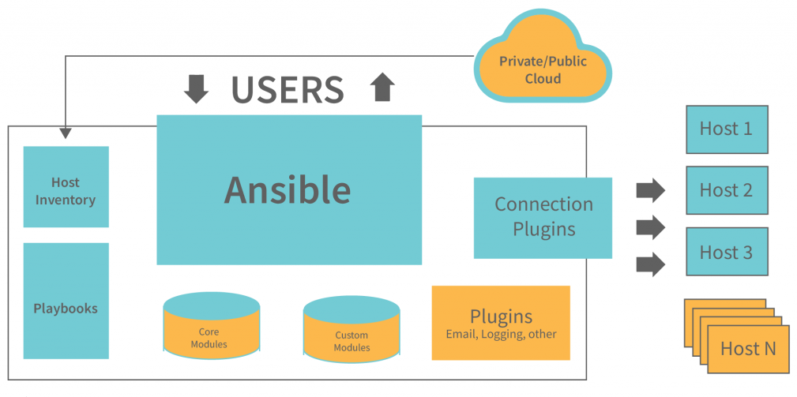

# What Is Ansible?
Ansible is an open-source automation tool that simplifies the process of IT infrastructure configuration management, application deployment, and task automation. It enables you to automate repetitive tasks, manage complex configurations, and deploy applications efficiently across multiple servers or devices in your IT environment.

Key features of Ansible include:

- Agentless Architecture: Ansible uses SSH or WinRM to communicate with remote servers or devices, eliminating the need to install and manage agents on target hosts. This makes it easy to get started and reduces the overhead of managing agents.

- Declarative Language: Ansible playbooks, written in YAML format, use a declarative language that describes the desired state of the system. Rather than specifying detailed steps to achieve a task, you define the desired outcome, and Ansible handles the execution and configuration management.

- Idempotent Execution: Ansible playbooks are designed to be idempotent, meaning they can be run multiple times without causing unwanted changes. If the system is already in the desired state, Ansible will recognize this and take no action.

- Extensible Modules: Ansible provides a vast library of built-in modules that cover various tasks, from simple file management to complex cloud provisioning. Additionally, you can create custom modules in Python to extend Ansible's functionality to meet specific needs.

- Inventory Management: Ansible uses inventory files to define the hosts and groups it manages. These inventory files can be static or dynamic, allowing you to target different groups of hosts easily.

- Ad-hoc Commands: Ansible allows you to execute quick ad-hoc commands against multiple hosts without writing playbooks. This is useful for performing simple tasks or checking system information.

-    Community and Ecosystem: Ansible has a vibrant community and a rich ecosystem. It integrates well with popular tools and platforms like Docker, Kubernetes, AWS, GCP, Azure, and more.

---

## Ansible Components and Architecture
The architecture of Ansible is straightforward and consists of the following main components:

- Control Node: The control node is the machine where Ansible is installed and from where automation tasks are initiated. It is the central point of management for Ansible. The control node contains the Ansible software, playbooks, and inventory files that define the configuration and tasks to be executed on the managed nodes.

- Managed Nodes: The managed nodes are the target machines where Ansible executes tasks. These machines can be physical servers, virtual machines, or network devices. Ansible communicates with managed nodes over SSH for Linux-based systems or WinRM for Windows-based systems.

- Playbooks: Playbooks are written in YAML format and contain a series of tasks to be executed on the managed nodes. They define the desired state of the system and describe how to achieve that state. Playbooks can include roles, variables, conditionals, loops, and more, making them powerful and flexible.

- Modules: Ansible uses modules to perform specific tasks on the managed nodes. Modules are small pieces of code that are executed on the remote nodes to configure, install software, manage files, manage services, and perform various other actions. Ansible ships with a large number of built-in modules, and you can also create custom modules if needed.

- Inventory: The inventory file is a configuration file that defines the managed nodes and their grouping into different categories (e.g., web servers, database servers). It also contains information about the connection details, such as the IP address, SSH credentials, and WinRM credentials.

- Plugins: Ansible supports various plugins that extend its functionality. These plugins include connection plugins, inventory plugins, and callback plugins, among others.

- Facts: Facts are pieces of information gathered by Ansible about the managed nodes, such as the operating system, IP address, CPU details, etc. These facts are available as variables in playbooks and can be used for conditional tasks.

- Handlers: Handlers are tasks that are triggered by notifications sent by other tasks. For example, a service restart task can notify a handler to restart the service only if the configuration was changed.

- Vault: Ansible Vault allows you to encrypt sensitive data, such as passwords or API keys, within playbooks or variable files. This ensures that sensitive information is securely stored and managed.

The architecture of Ansible is designed to be agentless, making it easy to set up and use. The control node can manage multiple managed nodes simultaneously, making it an efficient tool for automating infrastructure and configuration management tasks.

