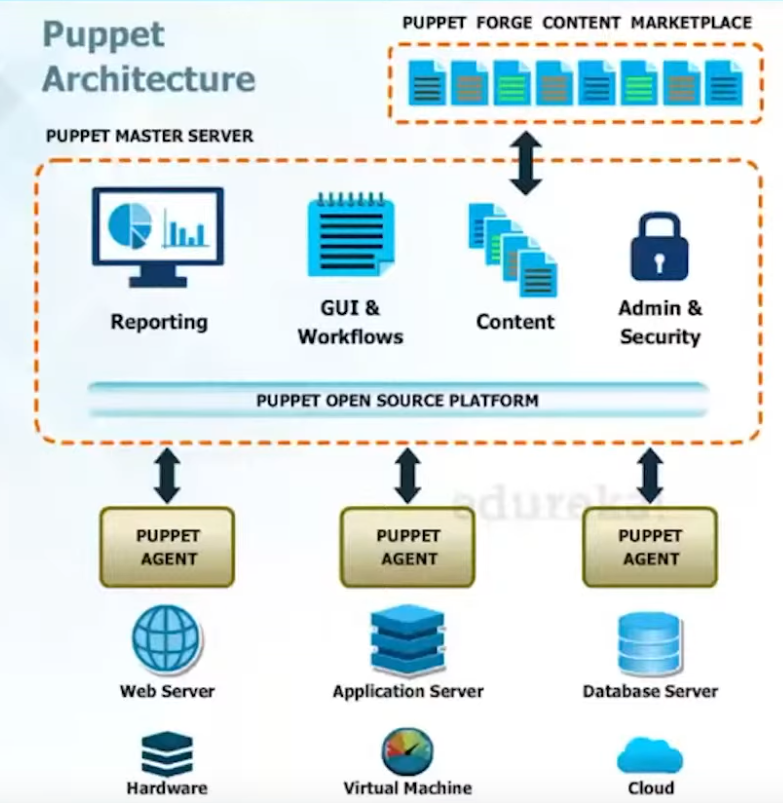
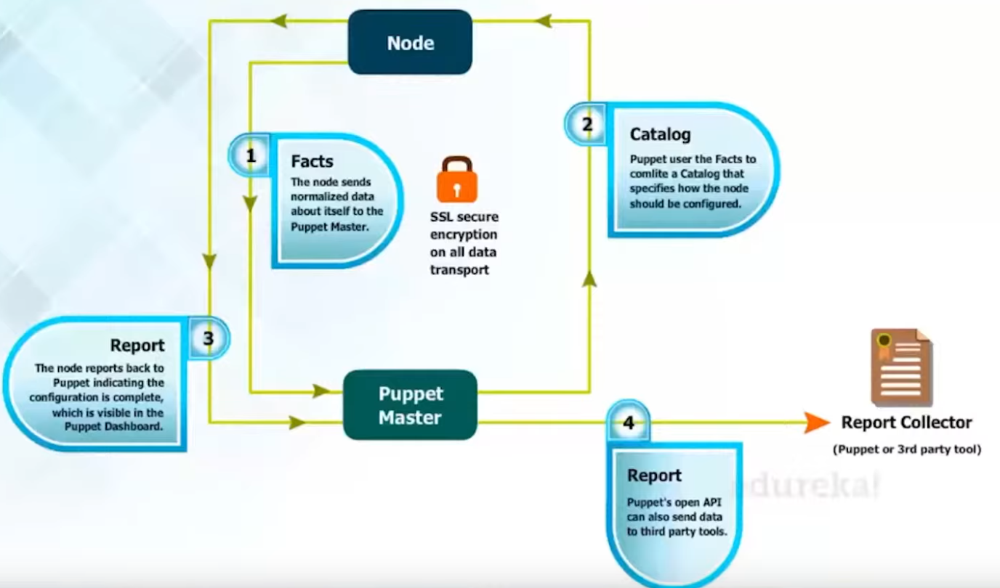
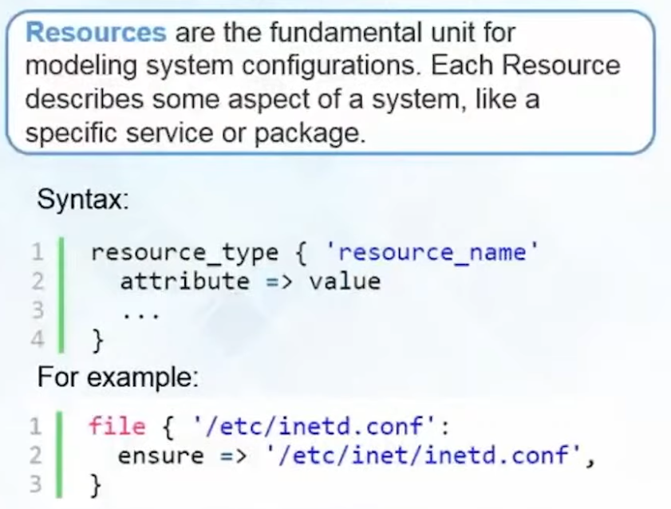
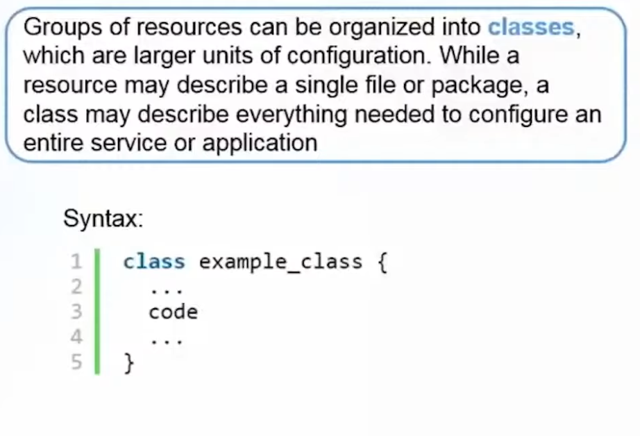
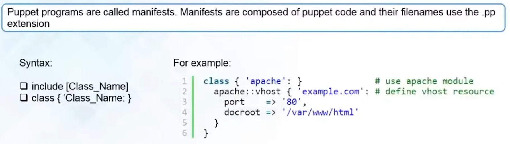
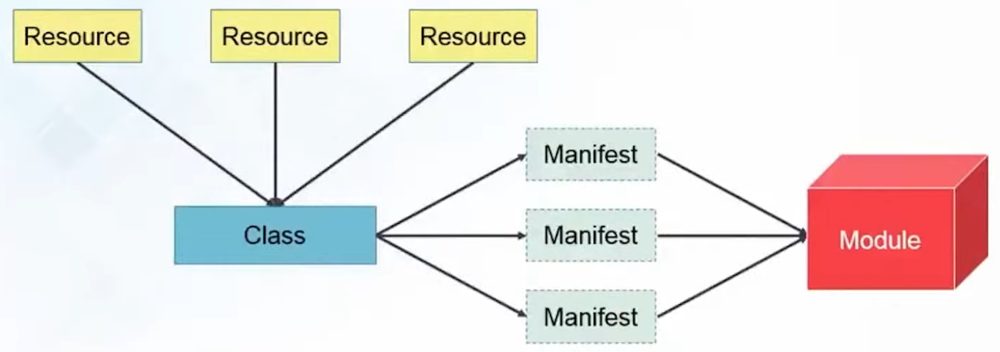

## What is Puppet and Why There is Need For It?
Puppet is a widely used open-source Configuration Management tool that allows you to automate the management and configuration of your software systems. It provides a declarative language for defining and enforcing the desired state of your infrastructure, enabling consistent and efficient management across a large number of systems.

Here are some key reasons why you might choose to use Puppet:

- Infrastructure as Code: Puppet follows an "Infrastructure as Code" approach, treating infrastructure configurations as code. This allows you to define and version your infrastructure configurations alongside your application code, promoting consistency, collaboration, and reproducibility.

- Declarative Language: Puppet uses a declarative language that describes the desired state of your infrastructure. Instead of specifying how to achieve that state, you define the end result you want. Puppet handles the details of making the necessary changes to bring the system into the desired state.

- Cross-Platform Support: Puppet supports a wide range of operating systems and platforms, including Linux, Windows, Unix, and more. It provides a unified approach to managing configurations across diverse environments, making it suitable for heterogeneous infrastructure setups.

- Centralized Management: With Puppet, you can define configurations centrally and manage them across multiple systems. This enables consistent enforcement of configurations, reduces manual effort, and simplifies the process of scaling infrastructure.

- Dependency Management: Puppet handles dependency management by automatically resolving and managing dependencies between resources. It ensures that resources are configured in the correct order, taking into account interdependencies and potential conflicts.

- Compliance and Auditing: Puppet allows you to define and enforce compliance policies, ensuring that your infrastructure adheres to security standards and regulations. It provides auditing capabilities to track and report on configuration changes, aiding in maintaining system integrity and compliance.

Puppet is particularly suitable for large-scale and complex infrastructure environments, where managing configurations across numerous systems is challenging. It offers a robust set of features for automating and managing infrastructure, promoting consistency, reducing manual errors, and enabling efficient infrastructure management practices.

---

## Puppet Architecture



The architecture of Puppet is designed to facilitate the management and configuration of systems across distributed environments. It consists of several key components that work together to enable the desired state configuration and automation. Here's an overview of the Puppet architecture:

- Puppet Master: The Puppet Master is the central component of the architecture. It serves as the control center for managing and distributing configurations to the managed nodes (also known as agents). The Puppet Master stores the configuration data and manifests, which describe the desired state of the infrastructure.

- Puppet Agent: The Puppet Agent, installed on each managed node, is responsible for executing configurations provided by the Puppet Master. It runs as a background service on the agent systems and communicates with the Puppet Master to retrieve the configurations and apply them to the local system.

- Manifests: Manifests are the files written in Puppet's declarative language (Puppet DSL) that define the desired state of the system. Manifests describe the resources, such as packages, files, services, and users, that should exist on the managed nodes. The Puppet Master serves these manifests to the Puppet Agents for execution.

- Modules: Modules are the building blocks of Puppet configurations. They encapsulate reusable code and configurations for specific tasks or components. Modules contain manifests, templates, files, and other related resources needed to manage a specific aspect of the system. Puppet modules can be shared, reused, and easily managed using tools like Puppet Forge.

- Facter: Facter is a system inventory tool that comes bundled with Puppet. It collects information about the managed nodes, such as hardware details, operating system, IP addresses, and custom facts. Facter provides this information to the Puppet Master, which can be used for conditionally applying configurations based on node characteristics.

- Certificate Authority (CA): Puppet uses a certificate-based authentication system for secure communication between the Puppet Master and Agents. The Certificate Authority (CA) component issues and manages the SSL certificates used by both the Puppet Master and Agents to establish secure communication channels.

- PuppetDB: PuppetDB is an optional component that provides a centralized database for storing Puppet's inventory and configuration data. It can be used for querying and reporting on the state of the managed infrastructure. PuppetDB integrates with the Puppet Master and Agents to collect and store data about nodes, resources, and their relationships.

The Puppet architecture follows a client-server model, where the Puppet Agents periodically connect to the Puppet Master to retrieve configurations, apply them to the local system, and report back their status. The Puppet Master serves as the single source of truth for configurations, and it can manage a large number of Puppet Agents simultaneously.



---

## Since puppet have master-slave relationship, can we have more than one master? if so how agents know which master they should pull configuration from? and how masters know that they don't confilict configuration with each other?

<br>

In Puppet, the relationship between the Puppet Master and Agents follows a client-server model, where the Puppet Master acts as the central authority for configuration management. However, it's worth noting that Puppet does not use the terms "master" and "slave" anymore. Instead, the Puppet Master is commonly referred to as the "Puppet Server" or simply the "server," while the Puppet Agents are referred to as "nodes."

Regarding your question about having multiple Puppet Masters, yes, it is possible to set up multiple Puppet Masters in what is known as a Puppet Server High Availability (HA) configuration. This allows for load balancing, fault tolerance, and improved scalability in larger Puppet deployments.

When there are multiple Puppet Masters in an HA configuration, the Puppet Agents need a mechanism to determine which Puppet Master they should connect to for retrieving their configurations. This is typically achieved through a load balancer or DNS round-robin configuration. The load balancer distributes the requests from Puppet Agents across the available Puppet Masters in a balanced manner.

The Puppet Masters in an HA configuration should share a common data store, usually a shared file system or a database, to store the configuration data. This ensures that the Puppet Masters have consistent and synchronized access to the configuration information. The shared data store helps prevent conflicts and ensures that all Puppet Masters have access to the same set of configurations.

To avoid configuration conflicts, Puppet provides a mechanism called "environment isolation." Each Puppet Master in an HA configuration can have its own isolated environment where configuration changes are managed independently. This means that each Puppet Master can have its own set of manifests, modules, and other configuration files specific to that environment. The Puppet Agents are assigned to a specific environment, and they retrieve the configurations from the corresponding Puppet Master.

By using load balancing, shared data stores, and environment isolation, Puppet effectively manages the distribution of configurations across multiple Puppet Masters, ensuring consistency and preventing conflicts. This setup allows for scalability, fault tolerance, and high availability in Puppet deployments.

---

## Puppet Secure Communication (SSL Cert)

Puppet uses secure communication between agents and the master through the following process:

- Certificate Generation: When a Puppet Agent is installed and configured, it generates a unique SSL certificate signing request (CSR) on the agent node.

- Certificate Signing: The Puppet Agent sends the CSR to the Puppet Master, requesting a signed certificate. The Puppet Master acts as the Certificate Authority (CA) and verifies the authenticity of the agent.

- Certificate Signing Process: The Puppet Master verifies the agent's identity and checks if the agent's CSR is valid. If everything is in order, the Puppet Master signs the agent's CSR, generating a signed SSL certificate for the agent.

- Certificate Exchange: The Puppet Master sends the signed SSL certificate back to the Puppet Agent. This certificate will be used by the agent to establish secure communication with the Puppet Master.

- Secure Communication: With the signed certificate in hand, the Puppet Agent can establish a secure connection with the Puppet Master. The communication is encrypted using SSL/TLS protocols, ensuring the confidentiality and integrity of the data exchanged between them.

- Configuration Retrieval: The Puppet Agent contacts the Puppet Master to retrieve its configuration. The Puppet Master sends the appropriate configuration files, manifests, and modules to the agent based on its assigned role or environment.

- Configuration Enforcement: The Puppet Agent applies the received configuration to the local system, ensuring that the system's state aligns with the desired configuration defined by the Puppet manifests.

- Periodic Communication: Puppet Agents periodically check in with the Puppet Master to detect changes in their configurations. If any changes are detected, the Puppet Agent retrieves the updated configurations and applies them to the system.

By using SSL certificates and encrypted communication, Puppet ensures the security and integrity of communication between the Puppet Master and Agents. The certificate-based authentication prevents unauthorized agents from connecting to the Puppet Master, and the encryption safeguards the configuration data exchanged between them.

Additionally, Puppet provides features like certificate revocation and certificate expiration to manage the lifecycle of certificates. This allows for secure communication even in dynamic environments where agents may join or leave the Puppet infrastructure over time.

---

## In Puppet, the key building blocks are resources, classes, manifests, and modules.

- Resources: Resources are the fundamental units of configuration management in Puppet. They represent the various components of a system that need to be managed, such as files, packages, services, users, groups, and more. Each resource has a unique name and a set of attributes that define its desired state. For example, a file resource may specify its path, permissions, owner, and content. Puppet uses a declarative language to define resources, allowing you to specify what the final state of each resource should be, rather than the steps to achieve that state.



- Classes: Classes in Puppet are logical groupings of related resources. They allow you to organize and encapsulate configurations in a modular manner. A class defines a set of resources and their desired states. It acts as a reusable template or blueprint that can be applied to multiple nodes. Classes can be defined and assigned to nodes based on their roles, environments, or any other criteria. For example, you might have a webserver class that includes resources for installing a web server package, configuring web server settings, and managing web application files.



- Manifests: Manifests are files that contain Puppet code written in a domain-specific language (DSL) called Puppet DSL. Manifests define the desired state of the system by declaring resources and their attributes. They are typically written with a .pp file extension. Manifests can contain both individual resource declarations and class definitions. They serve as the entry point for Puppet's configuration management process. Puppet agents read the manifests from the Puppet Master and apply the configurations specified within them.



- Modules: Modules are a way to organize and package Puppet code, including manifests, files, templates, and other related resources. A module is a directory structure that follows specific conventions and contains all the necessary files to manage a specific aspect of configuration. Modules encapsulate related resources, classes, and dependencies, making it easier to share and reuse Puppet code across different environments and systems. Modules can be downloaded from the Puppet Forge or created by users themselves.



The workflow typically involves writing manifests that define resources and classes, organizing them into modules, and assigning classes to nodes or node groups based on their requirements. Puppet agents then retrieve the assigned configurations from the Puppet Master and apply them, ensuring that the desired state defined in the manifests is achieved on the target systems.

---

##  basic syntax examples for Puppet code:

Defining a File Resource:
```sh
file { '/path/to/file':
  ensure => present,
  owner  => 'root',
  group  => 'root',
  mode   => '0644',
  content => 'Hello, World!',
}
```

Managing a Package:
```sh
package { 'nginx':
  ensure => installed,
}
```

Managing a Service:
```sh
service { 'nginx':
  ensure => running,
  enable => true,
}
```

Defining a Class:
```sh
class webserver {
  package { 'nginx':
    ensure => installed,
  }

  service { 'nginx':
    ensure => running,
    enable => true,
  }
}
```

Including a Class in a Node:
```sh
node 'example.com' {
  include webserver
}
```

Using Variables:
```sh
$message = 'Hello, World!'

file { '/path/to/file':
  ensure  => present,
  content => $message,
}
```

Conditional Statements:
```sh
if $environment == 'production' {
  file { '/path/to/file':
    ensure => present,
  }
} else {
  file { '/path/to/other/file':
    ensure => present,
  }
}
```

Using Templates:
```sh
file { '/path/to/file':
  ensure  => present,
  content => template('module_name/template_name.erb'),
}
```

--- 

## Run any desire command using "exec"

Here's an example that uses the exec resource in Puppet to download a file using wget, change its permissions, read its content, and write it to a new file:

```sh
exec { 'download_and_process_file':
  command     => 'wget -O /path/to/downloaded/file www.example.com/source.txt && chmod 600 /path/to/downloaded/file && cat /path/to/downloaded/file > /path/to/new/file.txt',
  path        => '/usr/bin:/usr/sbin:/bin',
  creates     => '/path/to/new/file.txt',
  refreshonly => true,
}
```

In this example:
- The exec resource is named 'download_and_process_file'. You can choose any descriptive name for the resource.
- The command attribute contains the sequence of commands to be executed. The wget command is used to download the file from www.example.com/source.txt. Then, chmod is used to change the file permissions to 600. Finally, cat is used to read the content of the downloaded file and redirect it to /path/to/new/file.txt.
- The path attribute is set to specify the search path for the commands. In this case, it includes commonly used locations such as /usr/bin, /usr/sbin, and /bin.
- The creates attribute specifies that the command should only run if the file /path/to/new/file.txt does not exist. This ensures that the command is not executed unnecessarily.
- The refreshonly attribute is set to true, indicating that the command should only be run as a refresh mechanism triggered by other resources.

---

## Here are some commonly used attributes in Puppet:

- ensure: Specifies the desired state of a resource, such as whether it should be present, absent, installed, or running.
- name: Represents the name or identifier of a resource. It uniquely identifies the resource within a Puppet manifest.
- path: Sets the search path for executable files used within the resource.
- owner: Defines the owner of a file or directory.
- group: Sets the group ownership of a file or directory.
- mode: Specifies the permissions or mode of a file or directory, represented in octal notation.
- content: Sets the content of a file resource. It can be specified as a string or a template.
- source: Specifies the source file or URL from which a file resource should be copied.
- command: Represents the command to be executed in an exec resource.
- user: Specifies the user under which a command should be executed in an exec resource.
- creates: Specifies a file path. If the file specified by creates exists, the resource is considered already created and will not be executed again.
- require: Defines dependencies between resources. It ensures that a resource is applied only after the specified dependency resource is in the desired state.
- notify: Specifies resources that should be notified or triggered if the current resource changes its state.
- subscribe: Represents resources that should subscribe to changes in the current resource.
- refreshonly: Specifies that a resource should only be executed as a refresh mechanism triggered by other resources.
- onlyif: Specifies a command or script that determines if the resource should be applied.
- unless: Specifies a command or script that determines if the resource should not be applied.
- timeout: Sets the maximum amount of time to wait for a resource operation to complete.
- environment: Specifies the environment variables to set when executing a resource.
- path: Sets the environment PATH variable for a specific resource.
- loglevel: Sets the log level for a resource.
- backup: Specifies whether to create backups of files before modifying them.
- purge: Removes unmanaged files and directories when managing a directory resource.
- recurse: Specifies whether to recursively manage files and directories within a directory resource.
- show_diff: Specifies whether to display differences when modifying a file resource.
- force: Forces an action or overwrite when managing a resource.
- template: Specifies the source template file for a file resource.
- source_permissions: Sets the permissions of the source file when copying it with a file resource.
- checksum: Specifies the checksum type for verifying the integrity of a file resource.
- provider: Specifies the provider or implementation to use for a resource.