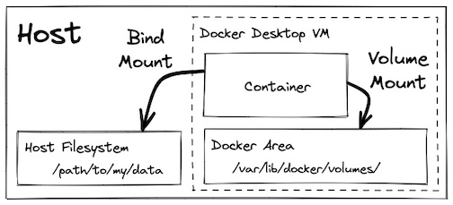

Data on containers are ephermal and we would loose all data after container is stop and exited. But in some situations, applications might produce data that we need to safely persist (e.g. database data, user uploaded data, etc...) even if the containers are destroyed and recreated. Luckily, Docker (and containers more generally) have a feature to handle this use case called `Volumes` and `mounts`!



`Volumes` and `mounts` allow us to specify a location where data should persist beyond the lifecycle of a single container. The data can live in a location managed by Docker (`volume mount`), a location in your host filesystem (`bind mount`), or in memory (`tmpfs mount`, not pictured). 

***NOTE:** This third option (`tmpfs mount`) does not persist the data after the container exits, and is instead used as a temporary store for data you specifically DON'T want to persist (for example credential files). It is included here for completeness but should not be used for application data you want to persist.*

Let's see some examples of Volume and Bind mounts:
# i. Volume Mounts
We can use volumes and mounts to safely persist the data.

```bash
# create a named volume
docker volume create my-volume

# Create a container and mount the volume into the container filesystem
docker run  -it --rm --mount source=my-volume,destination=/my-data/ ubuntu:22.04
# There is a similar (but shorter) syntax using -v which accomplishes the same
docker run  -it --rm -v my-volume:/my-data ubuntu:22.04

# Now we can create and store the file into the location we mounted the volume
echo "Hello from the container!" > /my-data/hello.txt
cat my-data/hello.txt
exit
```

**Where is this data located? On linux it would be at `/var/lib/docker/volumes`... but remember, on docker desktop, Docker runs a linux virtual machine.** One way we can view the filesystem of that VM is to use a [container image](https://hub.docker.com/r/justincormack/nsenter1) created by `justincormat` that allows us to create a container within the namespace of PID 1. This effectively gives us a container with root access in that VM. 

***NOTE:** Generally you should be careful running containers in privileged mode with access to the host system in this way. Only do it if you have a specific reason to do so and you trust the container image.*

```bash
# Create a container that can access the Docker Linux VM
# Pinning to the image hash ensures it is this SPECIFIC image and not an updated one helps minimize the potential of a supply chain attack
docker run -it --rm --privileged --pid=host justincormack/nsenter1@sha256:5af0be5e42ebd55eea2c593e4622f810065c3f45bb805eaacf43f08f3d06ffd8

# Navigate to the volume inside the VM at:
ls /var/lib/docker/volumes/my-volume/_data
cat /var/lib/docker/volumes/my-volume/_data/hello.txt # Woohoo! we found our data!
```


# ii. Bind Mounts

Alternatively, we can mount a directory from the host system using a bind mount:

```bash
# Create a container that mounts a directory from the host filesystem into the container
docker run  -it --rm --mount type=bind,source="${PWD}"/my-data,destination=/my-data ubuntu:22.04
# Again, there is a similar (but shorter) syntax using -v which accomplishes the same
docker run  -it --rm -v ${PWD}/my-data:/my-data ubuntu:22.04

echo "Hello from the container!" > /my-data/hello.txt

# You should also be able to see the hello.txt file on your host system
cat my-data/hello.txt
exit
```

Bind mounts can be nice if you want easy visibility into the data being stored, but there are a number of reasons outlined at https://docs.docker.com/storage/volumes/ (including speed if you are running Docker Desktop on windows/mac) for why volumes are preferred. 

---

## Some of Use Case of Persisting Data 
#### Postgres 
https://hub.docker.com/_/postgres
```bash
docker run -d --rm \
  -v pgdata:/var/lib/postgresql/data \
  -e POSTGRES_PASSWORD=foobarbaz \
  -p 5432:5432 \
  postgres:15.1-alpine

# With custom postresql.conf file
docker run -d --rm \
  -v pgdata:/var/lib/postgresql/data \
  -v ${PWD}/postgres.conf:/etc/postgresql/postgresql.conf \
  -e POSTGRES_PASSWORD=foobarbaz \
  -p 5432:5432 \
  postgres:15.1-alpine -c 'config_file=/etc/postgresql/postgresql.conf'
```

#### Mongo
https://hub.docker.com/_/mongo
```bash
docker run -d --rm \
  -v mongodata:/data/db \
  -e MONGO_INITDB_ROOT_USERNAME=root \
  -e MONGO_INITDB_ROOT_PASSWORD=foobarbaz \
  -p 27017:27017 \
  mongo:6.0.4

# With custom mongod.conf file
docker run -d --rm \
  -v mongodata:/data/db \
  -v ${PWD}/mongod.conf:/etc/mongod.conf \
  -e MONGO_INITDB_ROOT_USERNAME=root \
  -e MONGO_INITDB_ROOT_PASSWORD=foobarbaz \
  -p 27017:27017 \
  mongo:6.0.4 --config /etc/mongod.conf
```

---

## Mouting Remote or Cloud Storage:
You can do this using various ways two of them are:
- To mount the remote storage locally using tools such as `sshfs` 
    - ```sh 
        > sshfs user@remote-machine:/path/on/remote /path/on/local```
- To use `Rex-Ray` (rexray) volume driver that allows you to use various external storage systems as volumes, including remote or cloud-based storage.
    - ```sh
        1. Install Rex-Ray on your Docker host following the appropriate documentation for your operating system.
        2. Configure the Rex-Ray plugin to connect to your remote storage system. This may involve providing credentials, endpoint information, and any other required configuration parameters.
        3. Create a Docker volume using the Rex-Ray driver. The specifics of creating the volume may depend on the storage system you are using. Here 
        an example using the "ebs" driver for Amazon Elastic Block Store:
         
        > docker volume create -d rexray/ebs myvolume

        # Replace myvolume with the desired name for your volume. Run a Docker container and mount the remote volume using the created volume:

        > docker run -v myvolume:/path/in/container -it myimage```

