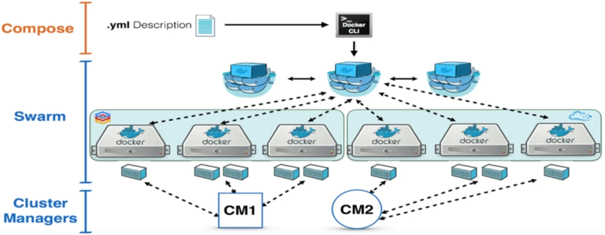

# What Is Docker Compose?
Docker Compose is a tool provided by Docker that simplifies the management of multi-container applications. It allows you to define and orchestrate multiple Docker containers as a single application, making it easier to deploy, scale, and manage complex containerized applications.

Here's an overview of what Docker Compose is used for:

- Defining and managing multi-container applications: Docker Compose uses a YAML file (usually named `docker-compose.yml`) to define the services, networks, volumes, and other configurations required for your application. You can specify the container images, ports, environment variables, dependencies, and other settings for each service.

- Orchestrating container deployments: Docker Compose provides a simple way to spin up, scale, and manage multi-container applications. With a single command, you can create and start all the containers defined in your docker-compose.yml file, ensuring they are launched and connected as a cohesive application stack.

- Service dependencies and ordering: Docker Compose allows you to define dependencies between services, ensuring that dependent services are started before the services that rely on them. This ensures proper initialization and coordination between containers.

- Environment and configuration management: Docker Compose enables you to manage environment-specific configurations and variables easily. You can define different environment-specific versions of your docker-compose.yml file (e.g., `docker-compose.dev.yml`, `docker-compose.prod.yml`) and override specific settings based on the target environment.

- Simplified application deployment: With Docker Compose, you can package your entire application stack into a single YAML file. This simplifies the deployment process, as you can replicate the same application setup across different environments (development, staging, production) or even share it with other developers.

- Integration with other Docker tools: Docker Compose integrates seamlessly with other Docker tools and technologies. It works well with Docker Swarm for orchestration in a cluster environment and can be combined with Docker's service discovery and load balancing mechanisms.

Docker Compose simplifies the deployment and management of complex applications by providing a declarative way to define, configure, and launch multiple containers as a single application stack. It reduces the complexity of managing container dependencies and configurations, making it a popular choice for development, testing, and production environments.



---

## Part of Docker Compose File
The Compose file consists of several parts that define **services, networks, volumes, and other** configurations. Here's an overview of the main components:
-  Version: Specifies the version of the Docker Compose file syntax. It is defined at the top of the file and allows you to specify the Compose file format and features. It is only informative and optional and used for backward compatibility.

- Services: Defines the individual containers or services that make up your application. Each service has a name and configuration options, such as the Docker image to use, environment variables, exposed ports, volumes, and dependencies.

- Networks: Defines the networks to be used by the services. Networks allow containers to communicate with each other using DNS names. You can define custom networks or use the default network created by Docker Compose.

- Volumes: Specifies the volumes to be mounted into the containers. Volumes allow data to persist across container restarts or to be shared between containers.

- Environment variables: Allows you to set environment variables for the services defined in the Compose file. These variables can be used to configure the containers or provide runtime parameters.

- Build: Specifies the build context and Dockerfile location for building a custom image for a service.

- Depends_on: Specifies the dependencies between services, ensuring that dependent services are started before the dependent ones.

- Restart: Defines the restart policy for a service, specifying when a container should be restarted (e.g., "always", "on-failure", "unless-stopped").

- Links: Establishes legacy links between services for container communication. The links keyword is no longer recommended and has been replaced by user-defined networks (`networks` keyword) in recent versions of Docker Compose and Docker Swarm.

- Expose: Specifies the ports to expose from a container without publishing them to the host machine.

- Command: Overrides the default command specified in the Docker image with a custom command for a service.

- Entrypoint: Overrides the default entrypoint specified in the Docker image with a custom entrypoint for a service.

- Labels: Assigns metadata labels to containers, networks, and volumes.

- Logging: Configures the logging options for a service, specifying the log driver and its options.

- Healthcheck: Defines a health check for a service to monitor its status and availability.

- Configs: Defines configurations that can be used by services, allowing the injection of configuration files into containers.

- Secrets: Allows the use of sensitive data (such as credentials) as Docker secrets.


#### docker-compose File Example:
```yml
version: '3'

services:
  web:
    build:
      context: ./webapp      # Point to directory containing the Dockerfile
      dockerfile: Dockerfile # commonly used when your docker file is named something else than 'Dockerfile'
    # ==
    # build: ./webapp/<Dockerfile> # this will go the webapp direcotry and build Dockerfile. if you renamed Dockerfile then you need to specify the name.
    ports:
      - '80:80'
    environment:
      - APP_ENV=production
    depends_on:
      - db
    networks:
      - app-network
    volumes:
      - static-data:/app/static
      - ./html:/usr/share/nginx/html # bind mount (don't need to be specified at volumes section at bottom)

  db:
    image: mysql:latest
    container_name: mysql_database
    environment:
      - MYSQL_ROOT_PASSWORD=secret
      - MYSQL_DATABASE=myapp
    networks:
      - app-network
    volumes:
      - db-data:/var/lib/mysql

networks:
  app-network:
    driver: bridge

volumes:
  db-data:
  static-data:
```

- The `web` service is built using a Dockerfile located in the `./webapp` directory. It exposes port `80` and sets an environment variable `APP_ENV` to `production`. It depends on the db service and is connected to the `app-network`. It also mounts a volume named `static-data` for storing static files.

- The `db` service uses the `mysql:latest` image and sets environment variables for the root password and database name. It is connected to the `app-network` and mounts a volume named `db-data` to persist MySQL data.

- The `app-network` is a user-defined bridge network that both services are connected to.

- Two volumes, `db-data` and `static-data`, are defined to persist the data for the respective services.

#### Example 2: WordPress with MySQL
This example deploys a WordPress application using MySQL as the database backend.
```yml
version: '3.8'
services:
  wordpress:
    image: wordpress:latest
    ports:
      - '8080:80'
    depends_on:
      - db
    environment:
      - WORDPRESS_DB_HOST=db
      - WORDPRESS_DB_NAME=mydb
      - WORDPRESS_DB_USER=myuser
      - WORDPRESS_DB_PASSWORD=mypassword
    volumes:
      - wordpress_files:/var/www/html

  db:
    image: mysql:latest
    # instead of giving database password in plain text we can say it to read them from a file.
    volumes:
      - db_data:/var/lib/mysql
    secrets:
      # specify the secret keyword
      - db_root_pass
      - db_user_pass
    environment:
      - MYSQL_DATABASE=mydb
      - MYSQL_USER=myuser
      - MYSQL_PASSWORD=/run/secrets/db_user_pass # say that it needs to be read from this secret keyword
      - MYSQL_ROOT_PASSWORD=/run/secrets/db_root_pass

volumes:
  wordpress_files:
  db_data:

secrets:
  db_root_pass:
    file: <path_to_pass.txt>
  db_user_pass:
    file: <path_to_pass.txt>
```

#### Example 3: assigning static and dynamic IP
4 conatiners, 2 of them with static ip and other 2 with dynamic IP in some specified range.
```yml
version: '3.8'

services:
  container1:
    image: your_image1:latest
    networks:
      static_net:
        ipv4_address: 192.168.1.10

  container2:
    image: your_image2:latest
    networks:
      static_net:
        ipv4_address: 192.168.1.11

  container3:
    image: your_image3:latest
    networks:
      dynamic_net:
        # No need to specify ipv4_address

  container4:
    image: your_image4:latest
    networks:
      dynamic_net:
        # No need to specify ipv4_address

networks:
  static_net:
    driver: bridge
    ipam:
      config:
        - subnet: 192.168.1.0/24
          gateway: 192.168.1.1
          ip_range: 192.168.1.10/31  # Allow only 2 IPs in this subnet (we could also specify range in `subnet` and not used `ip_range` at all.)

  dynamic_net:
    driver: bridge
    ipam:
      config:
        - subnet: 10.10.1.0/24
          gateway: 10.10.1.1
          ip_range: 10.10.1.20/29  # Allow IPs from 10.10.1.20 to 10.10.1.27

```