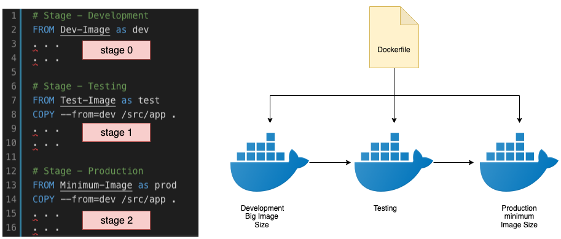

# What Is Multi-Stage Build in Dockerfile?
Multi-stage builds in Docker allow you to create more efficient and smaller Docker images by using multiple stages or phases within a single Dockerfile. Each stage can have its own base image and set of instructions, enabling you to perform different tasks in each stage and selectively copy only the necessary artifacts to the final stage. This helps reduce the size and complexity of the resulting image.



Here's how multi-stage builds work:

1. In a multi-stage build, you define multiple stages in your Dockerfile, each with its own FROM instruction. Each stage can have a different base image, depending on the specific requirements of that stage.  Each stage can be named using the `as` keyword, followed by a name. For example, `as build` and `as production`. This allows you to reference specific stages later in the Dockerfile.

2. You can perform different tasks in each stage, such as building dependencies, compiling code, running tests, or generating artifacts. Each stage is isolated, allowing you to install and configure specific tools or packages as needed.

3. Within each stage, you can use any instruction available in a regular Dockerfile, such as `RUN, COPY, ADD, and CMD`, to perform the necessary tasks.

4. You can use the COPY `--from=<stage>` instruction to selectively copy files or directories from one stage to another. This allows you to include only the relevant artifacts in the final stage while excluding unnecessary build dependencies or intermediate files.

5. The final stage of the multi-stage build is the one that creates the resulting image. This stage can be a minimal base image, containing only the necessary runtime dependencies and the artifacts from previous stages.

The key benefit of multi-stage builds is that they help reduce the size of the resulting Docker image by discarding unnecessary build-time artifacts and dependencies. This results in smaller images that are more optimized for production use. Additionally, multi-stage builds improve the overall build process by separating build and runtime concerns. Developers can focus on the build stage, ensuring that the necessary build tools and dependencies are available, while operations teams can focus on the final stage, ensuring that the runtime image is lightweight and secure. Multi-stage builds are especially useful in scenarios where you have complex build processes, multiple build artifacts, or the need to build multiple versions of the same application with different dependencies. By leveraging multiple stages, you can streamline your build pipeline and generate efficient Docker images.

---

## Situations Where Multi-Stage Builds Can Be Beneficial + Example:
- **Building different versions of the same application**: If you need to build different versions of the same application with different dependencies (e.g., a production version and a development version), multi-stage builds can be valuable. You can define stages for each version, install the necessary dependencies, and generate separate artifacts. This approach allows you to manage the different versions efficiently while minimizing image size by excluding unnecessary dependencies.

- **Building applications with compiled code**: If you have an application that requires compiling code (e.g., Java, C++, Go), you can use multi-stage builds to separate the build environment from the runtime environment. This allows you to include only the compiled artifacts in the final image, reducing its size and eliminating unnecessary build dependencies.

- **Web application with frontend and backend**: In web applications, you may have a frontend (e.g., JavaScript, CSS) and a backend (e.g., API server). By using multi-stage builds, you can have one stage for building the frontend assets and another stage for the backend server. This way, you can generate optimized frontend files and combine them with the backend code in a single image.

- **Testing and production images**: You may want to separate your testing dependencies from the production image. With multi-stage builds, you can have a stage for running tests, including test frameworks and libraries, and a separate stage for the production image that includes only the necessary runtime dependencies. This ensures that the final production image is lightweight and doesn't include testing-related artifacts.

Let's see an example implementation of a multi-stage build for a Java application:

```Dockerfile
# Stage 1: Build the application
FROM maven:3.8.4-openjdk-11-slim AS build
WORKDIR /app
COPY pom.xml .
RUN mvn dependency:go-offline
COPY src ./src
RUN mvn package

# Stage 2: Create the final image
FROM adoptopenjdk:11-jre-hotspot
WORKDIR /app
COPY --from=build /app/target/my-app.jar .
CMD ["java", "-jar", "my-app.jar"]
```
In this example:
- Stage 1 (build) uses a Maven base image to compile the Java application. It copies the necessary files, resolves dependencies, and builds the JAR file using mvn package.
- Stage 2 uses a different base image (adoptopenjdk:11-jre-hotspot) which only includes the Java runtime. It copies the JAR file generated in the previous stage and sets the command to run the application.

By using multi-stage builds, you eliminate the need to include Maven and build dependencies in the final image, resulting in a smaller and more efficient container.