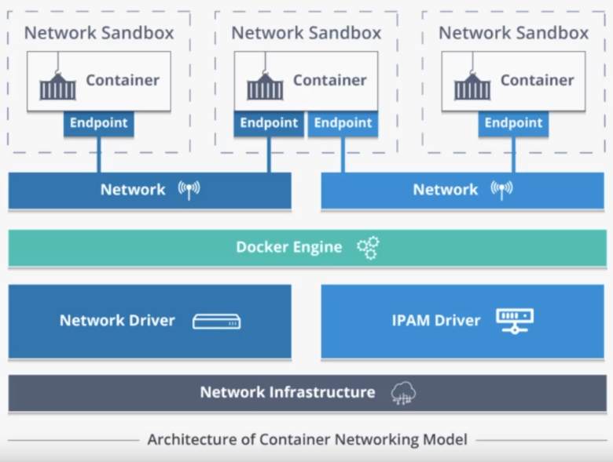

# What is Container Network Model (CNM) ?
The Container Network Model (CNM) is a networking specification introduced by Docker to define the network connectivity and communication between containers within a Docker environment. CNM is part of the Docker Engine and provides a framework for container networking.



Key aspects of the CNM include:

- Network Types: CNM supports different network types, including bridge networks, overlay networks, and host networks, allowing containers to communicate and connect using different network topologies.

- Network Drivers: CNM introduces network drivers that implement the network types. Each network type has its own driver responsible for managing the network connectivity for containers using that network type.

- Endpoint: An endpoint is a virtual network interface associated with a container. It provides a unique network identity to a container and enables it to participate in network communication.

- Sandbox: A sandbox is a lightweight virtual network stack created for each container. It encapsulates the network settings and connectivity of the container, enabling isolation and security.

- Network Controller: The network controller is responsible for managing the network resources, such as creating and deleting networks, endpoints, and sandboxes, as well as configuring the network settings.

By leveraging CNM, Docker provides a flexible and extensible networking framework for containers, enabling communication and connectivity between containers within a Docker environment. CNM allows containers to communicate over different network types, such as bridge networks for isolated container-to-container communication or overlay networks for distributed communication across multiple hosts. CNM is an essential component of Docker's networking capabilities, allowing users to define and manage container networks efficiently and enabling containers to interact with each other and external systems in a controlled and secure manner.

---

## How docker actually create different network interfaces for containers
Docker creates different network interfaces for containers using various network drivers and virtual network technologies, depending on the network type and configuration.

- Bridge Networks: Bridge networks are the default network type in Docker. When you create a container and attach it to a bridge network, Docker creates a virtual Ethernet bridge interface (e.g., docker0) on the host. Each container connected to the bridge network is assigned a unique virtual Ethernet interface (e.g., eth0 inside the container) and an IP address within the bridge network subnet. Docker manages the routing and connectivity between containers through this bridge interface.

- Overlay Networks: Overlay networks enable container communication across multiple hosts. Docker uses a combination of virtual network technologies like VXLAN (Virtual Extensible LAN) or IP-in-IP encapsulation to create an overlay network fabric. Each container connected to an overlay network has a virtual Ethernet interface (e.g., eth0) inside the container, similar to bridge networks. However, the underlying network infrastructure routes the overlay network traffic between different hosts.

- Host Networks: When a container is connected to the host network, it uses the host's network stack directly, sharing the network namespace with the host. In this case, Docker does not create a separate network interface for the container. The container uses the same network interface as the host, allowing it to have direct access to the host's network stack.

- Macvlan Networks: Macvlan networks allow containers to have their own MAC addresses, making them appear as separate physical devices on the network. Docker creates a virtual network interface associated with each container, providing a unique MAC address and IP address on the network.

- Null Network : the "null" network is a predefined network that represents a network stack with no network connectivity. It is primarily used for containers that require complete network isolation or when you want to prevent a container from accessing any network resources.

These are just a few examples of network types in Docker, and there are other network drivers and technologies available as well. Docker manages the creation and configuration of network interfaces using these drivers, allowing containers to communicate within their assigned network contexts.

---

## Some Docker Network Commands

Create a network: This command creates a new user-defined bridge network with the specified name.
```bash
> docker network create <network_name>
# you can use --subnect and --gateway flags to specify subnect and gateway address for your network
```

List networks: This command lists all the networks created on your Docker host.
```bash
> docker network ls
```


Inspect a network: This command provides detailed information about a specific network, including its configuration and connected containers.
```bash
> docker network inspect <network_name>
```


Connect a container to a network: This command connects a running container to a specified network.
```bash
# it is used when you already create a container
> docker network connect <network_name> <container_name>
# if you want to connect a network to a new container that you want to create now use --net flag in docker run
> docker run --net <network_name> <image_name>
```


Disconnect a container from a network: This command disconnects a running container from a specified network.
```bash
> docker network disconnect <network_name> <container_name>
```


Remove a network: This command removes a specified network. The network must not have any connected containers.
```bash
> docker network rm <network_name>
```

---

## Network Types That Come By Default And You Can't Create New Instance of Them
- host : In Docker, the host network is a pre-existing network stack that refers to the networking capabilities of the host machine itself. You cannot create a new host network using Docker networking commands. But you can create a container and connect it to pre-existing host network, To create a Docker container that uses the host network, you can use the `--network=host` option when running the container. This option allows the container to use the network stack of the host directly, without any network isolation. When you run a container using the host network mode (`--network=host`), it means the container directly uses the networking stack of the host machine. This allows the container to have the same network namespace as the host, effectively using the host network interfaces, IP addresses, and ports.
```bash
> docker run --network=host <image_name>
```

- null : The null network acts as a black hole for network traffic. When a container is connected to the null network, all network traffic originating from or destined for the container is discarded. This effectively isolates the container from any network communication. The null network is a built-in network in Docker, and it is not intended to be modified or used for container communication. It is used primarily for situations where you want to restrict network access for specific containers. Since the null network is predefined and cannot be modified or created, you won't find commands to create a new null network in Docker. It is part of Docker's network infrastructure and is automatically available for use. To use the null network, you can connect a container to it by specifying the network name as "none" when running the container:
```bash
> docker run --network=none <image_name>
```


