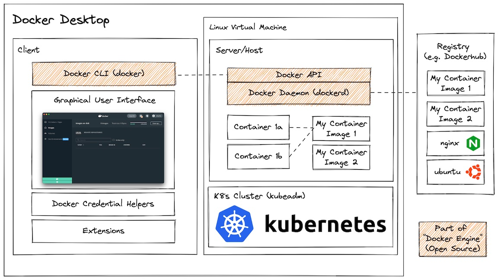

# Docker
Docker is an open-source platform that allows you to package and distribute software applications in a standardized way called containers. Containers are lightweight, isolated environments that contain everything needed to run an application, including its code, dependencies, libraries, and system tools.

To understand containers, think of them as self-contained boxes that encapsulate an application and everything it requires to run. Each container runs as an isolated process on a host machine, sharing the host's operating system kernel but having its own isolated file system, network interface, and process space.

---

## Differences between Docker, Docker Engine and Docker Desktop:
The terms "Docker," "Docker Engine," and "Docker Desktop" are related to the Docker platform but refer to different components and concepts. Here's an explanation of each term:

- Docker: Docker is an open-source platform that allows developers to automate the deployment and management of applications using containerization. It provides a set of tools and technologies to build, package, and distribute applications as lightweight, portable containers. Docker enables applications to run consistently across different environments, from development to production, by encapsulating the application code, dependencies, and configurations into a single container. 

- Docker Engine: Docker Engine, also known as Docker runtime, is the core component of the Docker platform. It is responsible for building and running containers. The combination of the Docker CLI (Command-Line Interface) and the Docker daemon forms the core components of Docker Engine. Docker Engine includes the Docker daemon (dockerd), which is a background service that manages the creation, execution, and monitoring of containers. The Docker CLI (Command Line Interface) is used to interact with the Docker daemon and execute commands to manage containers, images, networks, and volumes. The Docker CLI acts as the user-facing interface, issuing commands and managing the client-side operations, while the Docker daemon handles the server-side operations, interacting with the host operating system and managing the container lifecycle. Docker Engine runs on the host operating system and leverages Linux kernel features, such as namespaces and cgroups, for container isolation.

- Docker Desktop: Docker Desktop is a user-friendly application that provides an easy-to-use interface and tools for working with Docker on Windows and macOS operating systems. It includes the Docker Engine, Docker CLI, and additional components required for running Docker containers on a developer's local machine. Docker Desktop provides a graphical user interface (GUI) for managing containers, images, volumes, and networks. It also offers features like integrated container registry, logging, resource allocation settings, and seamless integration with development tools and workflows.

In summary, Docker is the overall platform that enables containerization and automates application deployment. Docker Engine is the core runtime responsible for building and running containers, while Docker Desktop is a user-friendly application that includes Docker Engine and provides a GUI and additional features for local development and testing.

> **Docker is the overall platform that enables containerization and provides a set of tools and technologies to build, package, and distribute applications as containers. It includes multiple components, such as Docker Engine (the core runtime), Docker CLI, Docker Compose, Docker Swarm, and more. Docker Engine is responsible for running containers, while Docker CLI is used to interact with the Docker daemon and execute commands to manage containers, images, networks, and other Docker-related resources.**

--- 

## Data Inside Containers
Data inside a container is typically stored in two primary forms: the container's writable layer and volumes.

> 1. Container's Writable Layer: When you run a container, it creates a writable layer on top of the underlying image layers. This writable layer is where any changes made to the container's file system occur. The container's writable layer is ephemeral, meaning that changes made to the container's file system are not persisted if the container is stopped or removed. Each time a new container is created from the same image, it starts with a clean writable layer.

> 2. Volumes: Volumes in Docker provide a way to persist and share data between containers and the host machine. A volume is a specially designated directory within the host's file system or a remote storage system that is mounted into the container at a specific path. Volumes are separate from the container's file system and exist independently of the container's lifecycle. They enable data to be stored outside the container, allowing it to persist even if the container is stopped or deleted.

Volumes in Docker can be mounted both inside and outside the container, depending on how you configure them.

-  Inside the Container: By default, when you define a volume in Docker, it is mounted inside the container. This means that the container has direct access to the volume and can read from and write to it. The volume appears as a directory within the container's file system, and any data written to that directory is stored in the volume.

- Outside the Container: Docker also provides the ability to mount volumes outside the container, which means the volume is located on the host machine or a remote storage system. When you mount a volume outside the container, the container has access to the data stored in that volume, but it is accessed via a mount point within the container's file system. This allows you to provide data to the container from the host or share data between multiple containers.

---

## Docker Application Architecture

Docker Desktop is an application you install on development systems that provides:
- A client application:
  - Docker CLI (command line interface for interacting with Docker)
  - GUI for configuring various system settings
  - Credential helpers for accessing registries
  - Extensions (3rd party plugins)
- A Linux virtual machine containing:
  - Docker daemon (dockerd), exposing the Docker API
  - (Optional) Kubernetes cluster

Docker Desktop is free for personal use, but requires a subscription for [certain commercial use cases](https://www.docker.com/pricing/faq/).

Docker Engine refers to a subset of those component which are free and open source and can be installed only on Linux. Specifically Docker Engine includes:
- Docker CLI
- Docker daemon (dockerd), exposing the Docker API

Docker Engine can build container images, run containers from them, and generally do most things that Docker Desktop but is Linux only and doesn't provide all of the developer experience polish that Docker Desktop provides.

Container image registries are not part of Docker itself, but because they are the primary mechanism for storing and sharing container images it is worth including it here. Docker runs a registry named DockerHub, but there are many other registries as well.

 
