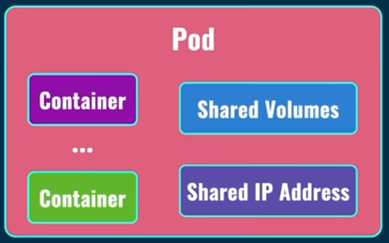

# What Is Kubernetes (K8S)?
Kubernetes is an open-source container orchestration platform that automates the deployment, scaling, and management of containerized applications. It was originally developed by Google and is now maintained by the Cloud Native Computing Foundation (CNCF). Kubernetes provides a robust framework for running and managing containers across a cluster of machines. It offers a range of features and capabilities that simplify the deployment and operation of applications in a distributed environment. 

Some key aspects and use cases of Kubernetes include:

- Container Orchestration: Kubernetes enables you to efficiently manage containers at scale. It automates tasks such as scheduling containers, scaling applications based on demand, and distributing workloads across the cluster.

- Service Discovery and Load Balancing: Kubernetes provides built-in service discovery and load balancing mechanisms. It allows you to expose containers as services and automatically routes network traffic to the appropriate instances, ensuring high availability and fault tolerance.

- Automatic Scaling: Kubernetes allows you to define scaling rules and policies for your applications. It can automatically scale the number of containers based on CPU usage, memory consumption, or custom metrics, ensuring optimal resource utilization.

- Self-Healing and Fault Tolerance: Kubernetes monitors the health of containers and automatically restarts or replaces them in case of failures. It also supports advanced features such as rolling updates and canary deployments, minimizing downtime and ensuring the reliability of your applications.

- Declarative Configuration: Kubernetes uses a declarative approach, where you define the desired state of your application using YAML or JSON manifests. It continuously reconciles the actual state with the desired state, making necessary adjustments to ensure convergence.

- Storage and Networking: Kubernetes provides abstractions for managing storage and networking resources. It supports different storage plugins and network models, allowing you to configure persistent storage, attach volumes, and define network policies for your applications.

- Portability and Flexibility: Kubernetes is designed to be platform-agnostic and can run on various cloud providers, on-premises infrastructure, or hybrid environments. It provides a consistent API and deployment model, enabling application portability and flexibility.

Kubernetes has become the de facto standard for container orchestration and is widely adopted in cloud-native application development. It simplifies the management of containerized applications, improves scalability and resiliency, and enables organizations to embrace modern application architectures.

---

## What Is POD in K8B?
In Kubernetes, a Pod is the smallest and most basic deployable unit. It is a logical group of one or more containers that share the same network namespace and storage resources and are scheduled and managed together on a single node. A Pod represents a single instance of a running process within the cluster and encapsulates one or more containers. These containers are tightly coupled and share the same lifecycle, as they are scheduled together and run on the same host.

Some key points about Pods:

- Atomic Unit: A Pod is an atomic unit of deployment in Kubernetes. It represents a single instance of an application or a microservice.
- Co-located Containers: A Pod can include multiple containers that share the same resources, such as network and storage. These containers together to support the application running within the Pod.
- Shared Network Namespace: Containers within a Pod share the same network namespace and can communicate with each other using localhost.
- Shared Storage: Containers within a Pod can mount shared volumes, allowing them to share data.
- Lifecycle: All containers within a Pod are scheduled and managed together. They are created, started, stopped, and terminated as a single unit.
- Single IP Address: A Pod is assigned a single unique IP address within the cluster, which is used for internal communication within the Pod.
- Colocation for Interdependent Containers: Containers within a Pod are typically used for tightly coupled functionalities, such as an application its sidecar proxy or a web server and its logging agent.

The concept of Pods in Kubernetes enables the co-location of related containers and provides an abstraction for managing and scaling application components. Pods are often used as building blocks for higher-level abstractions, such as Deployments, StatefulSets, and ReplicaSets, which provide more advanced deployment and management capabilities.

---

later

Kubernetes (K8s) follows a distributed and modular architecture that enables the deployment, management, and scaling of containerized applications across a cluster of machines. Here's a detailed explanation of the key components and their roles in the Kubernetes architecture:

    Master Node:
        API Server: The API server is the central control point for the Kubernetes cluster. It exposes the Kubernetes API, which clients use to interact with the cluster, and handles authentication, authorization, and validation of API requests.
        Scheduler: The scheduler is responsible for assigning pods (groups of containers) to nodes based on resource requirements, node capacities, and other constraints. It determines the optimal placement of pods to achieve efficient resource utilization and high availability.
        Controller Manager: The controller manager includes several controllers that continuously monitor the state of the cluster and drive it towards the desired state. Controllers handle tasks such as node management, replication, scaling, and managing various resources in the cluster.
        etcd: etcd is a distributed key-value store used as the cluster's backing store. It stores the persistent cluster state, including configuration data, secrets, and metadata about pods, nodes, and other Kubernetes objects.

    Worker Nodes:
        Kubelet: The kubelet is an agent that runs on each worker node and communicates with the master node. It ensures that containers are running and healthy on the node by interacting with the container runtime (such as Docker or Containerd) and managing pod lifecycle.
        Container Runtime: The container runtime, such as Docker or Containerd, is responsible for building, running, and managing containers. It executes the container images and provides isolation and resource management.
        Kube Proxy: Kube Proxy is responsible for network communication within the cluster. It maintains network rules, load balancing, and routing for services running on the node. It also facilitates communication between pods across the cluster.

    Networking:
        Pod Network: Each pod has its own unique IP address within the cluster. Pod networking enables communication between pods and services.
        Service: Services abstract the network endpoint for a set of pods and provide a stable IP and DNS name for accessing the pods. They enable load balancing and dynamic service discovery within the cluster.

    Volumes:
        Persistent Volume: A persistent volume is a cluster-wide storage resource that can be provisioned and managed independently from individual pods. It provides durable storage that can be dynamically bound to pods requiring persistent data.

    Ingress:
        Ingress Controller: The Ingress controller acts as an entry point for external traffic into the cluster. It receives incoming requests and routes them to the appropriate services based on defined rules.

    Other Components:
        Namespace: Namespaces provide a logical separation and isolation within a cluster. They allow you to partition resources and define access policies for different groups or applications.
        Secrets and ConfigMaps: Secrets and ConfigMaps enable the storage and management of sensitive data and configuration settings that can be consumed by pods and containers.
        Horizontal Pod Autoscaler: The Horizontal Pod Autoscaler automatically scales the number of replicas of a pod based on defined resource metrics, ensuring optimal resource utilization and application performance.

The components of a Kubernetes cluster work together to provide a scalable, resilient, and manageable platform for running containerized applications. The architecture allows for efficient resource allocation, automated management, and seamless scaling, enabling organizations to deploy and manage complex applications with ease.

---

Node and cluster 

In Kubernetes (K8s), a cluster refers to a set of machines, called nodes, that collectively run containerized applications. A cluster is the foundational unit in K8s and provides the environment for managing and scaling containerized workloads. Each cluster consists of two main components: control plane (master) and worker nodes.

    Control Plane / Master:
        The control plane consists of multiple components that manage the overall state and operations of the cluster.
        The control plane components include the API server, scheduler, controller manager, and etcd (a distributed key-value store that stores cluster data).
        The control plane components run on dedicated nodes or can be co-located on a single node for smaller deployments.
        The control plane is responsible for receiving and processing API requests, scheduling pods, managing cluster resources, maintaining desired state, and enforcing policies.

    Worker Nodes:
        Worker nodes are the machines where containers are scheduled and run. They make up the compute resources of the cluster.
        Each worker node runs the container runtime (e.g., Docker, Containerd), kubelet (the primary node agent that interacts with the control plane), and kube-proxy (a network proxy that handles communication between pods and services).
        Worker nodes join the cluster and report their availability to the control plane.
        Pods, which encapsulate one or more containers, are scheduled and run on the worker nodes.

    Nodes:
        Nodes are the individual machines (physical or virtual) within a cluster that run containerized workloads.
        Each node has a unique identifier, an IP address, and a set of resources (such as CPU, memory, and storage) available for running containers.
        Nodes are responsible for running the containers assigned to them, managing container lifecycle, and reporting the node's status and available resources back to the control plane.

    Node Components:
        Each worker node has several components running on it to support the execution of containers.
        The primary components are kubelet, which communicates with the control plane, and the container runtime (e.g., Docker) responsible for running the containers.
        Other components include kube-proxy, which handles network routing and load balancing, and various agents for managing storage, networking, and monitoring.

    Cluster:
        A cluster in Kubernetes refers to the entire environment that consists of the control plane and the worker nodes.
        The cluster provides a unified platform for deploying, managing, and scaling containerized applications.
        It abstracts away the underlying infrastructure and provides tools and APIs to interact with the cluster, deploy applications, and manage resources.

In summary, a Kubernetes cluster is a collection of nodes that run containerized workloads, managed by a control plane. The nodes host the containers, while the control plane handles scheduling, orchestration, and management of the cluster. Together, they provide a scalable and resilient platform for deploying and running applications in a distributed environment.