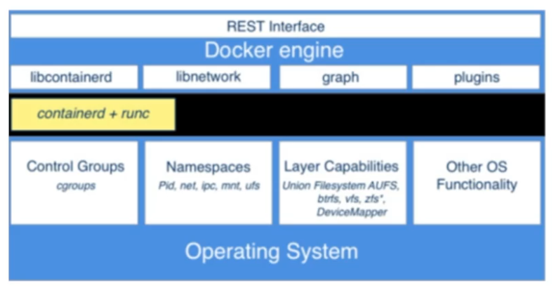

# What is Container?
A container is a lightweight and isolated runtime environment that packages an application along with its dependencies and configurations. It provides a consistent and portable unit for running software applications. Containers are built on top of the host machine's operating system kernel and share system resources with other containers and the host.

In simple terms, you can think of a container as a self-contained, virtualized environment that includes everything needed to run an application. It contains the application's code, libraries, system tools, and configuration files. By packaging all these components together, containers ensure that the application runs consistently across different computing environments.

Containers are different from traditional virtual machines (VMs). While VMs virtualize an entire operating system along with the application, containers virtualize at the operating system level and share the host machine's kernel. This makes containers lightweight, faster to start, and more resource-efficient compared to VMs.

---

## Containers provided Benefits :
- Portability: Containers provide a consistent and portable environment for applications. They encapsulate the application code, dependencies, and configuration into a single package, making it easy to deploy and run the application across different environments, such as development, testing, and production. Containers ensure that the application behaves consistently regardless of the underlying infrastructure.

- Isolation: Containers offer a high level of isolation between applications. Each container runs in its own isolated environment, with its own file system, network interface, and process space. This isolation prevents conflicts between applications and their dependencies, enhancing security and stability. It also allows multiple applications to run side by side on the same host without interfering with each other.

- Efficiency: Containers are lightweight and have minimal overhead. They share the host machine's operating system kernel, which reduces the duplication of system resources compared to traditional virtual machines. Containers start quickly, use fewer system resources, and allow for higher density of applications on a single host. This efficiency translates to improved performance and cost savings.

- Scalability: Containers are well-suited for scaling applications. With container orchestration platforms like Kubernetes, you can easily scale the number of container instances based on demand. Containers enable horizontal scaling, where multiple instances of an application can be created and distributed across multiple machines to handle increased traffic or workload. This scalability ensures that applications can respond to changes in demand effectively.

- DevOps and Continuous Deployment: Containers align well with DevOps practices and continuous deployment workflows. They enable developers to package their applications along with their dependencies and configurations, ensuring consistency between development, testing, and production environments. Containers can be versioned and easily deployed, making it straightforward to automate the deployment and rollback processes, perform rolling updates, and achieve rapid iteration cycles.

- Infrastructure Flexibility: Containers can run on various operating systems and cloud platforms. They provide flexibility in choosing the infrastructure where applications run, whether it's on-premises, in the cloud, or in a hybrid environment. Containers abstract away the underlying infrastructure details, allowing applications to be deployed and migrated across different environments with ease.

---

## Differences between containers and virtual machines:
Containers and virtual machines (VMs) are both technologies used to isolate and run applications, but they differ in their approach and level of virtualization. Here are the key differences between containers and virtual machines:

- **Resource Efficiency:** Containers are more resource-efficient than VMs. Containers share the host machine's operating system kernel, which eliminates the need to run a separate operating system for each container. As a result, containers have lower memory and disk space requirements compared to VMs.

- **Isolation:** Containers provide process-level isolation, meaning each container runs as an isolated process with its own file system, network interface, and process space. VMs, on the other hand, provide full operating system-level isolation, where each VM runs its own complete operating system instance. This isolation in VMs offers stronger security boundaries between applications, but it comes with higher resource overhead.

- **Startup Time:** Containers have faster startup times compared to VMs. Since containers do not require booting a complete operating system, they can start almost instantaneously. VMs, on the other hand, need to boot a full operating system, which takes more time.

- **Flexibility:** Containers are more flexible in terms of deployment and scalability. They can be easily replicated, distributed, and orchestrated using container orchestration platforms like Kubernetes. VMs, while also capable of scaling, require more effort and resources for deployment and management.

- **Operating System Support:** Containers are typically tied to the operating system of the host machine. This means that containers built for Linux can only run on Linux hosts, and containers built for Windows can only run on Windows hosts. In contrast, VMs can run different operating systems, allowing for more diverse application deployment scenarios.

- **Application Portability:** Containers offer higher application portability. Containerized applications can be packaged along with their dependencies, allowing them to be easily moved and deployed across different environments. VMs, while portable, may require additional configuration and customization when moving between different virtualization platforms.

In summary, containers provide lightweight and efficient isolation for applications, with fast startup times and flexible deployment options. They are well-suited for running multiple applications on a single host and enabling efficient scaling. On the other hand, VMs offer stronger isolation and can run different operating systems, making them useful for scenarios that require complete operating system-level separation.

---

## How containers achieve isolation?
Containers achieve isolation through a combination of Linux kernel features and namespace technologies. Here are the key mechanisms that enable container isolation:

1. **Namespaces:** Containers leverage Linux namespaces to create isolated environments for various system resources. Namespaces provide separate instances of resources for each container, such as the process ID (PID) namespace, network namespace, mount namespace, and more. Each container has its own unique view of these resources, which prevents interference and ensures isolation. 

2. **Control Groups (cgroups):** Control Groups, or cgroups, allow for resource allocation and management. They enable limiting and isolating system resources such as CPU, memory, disk I/O, and network bandwidth. Each container is associated with specific cgroups, which ensure that it only uses the allocated resources and does not impact other containers or the host system. 

3. **Filesystem Isolation:** Containers use techniques like UnionFS (Union File System) to provide isolated file systems. With UnionFS, multiple file systems are layered on top of each other, and changes made in one layer are visible only within that container, while still allowing shared access to read-only layers. This enables efficient storage utilization and isolation of container-specific file system changes. 

4. **Networking Isolation:** Containers have their own network stack, including network interfaces, IP addresses, and routing tables. Each container gets its isolated network namespace, enabling communication within the container and with other containers or the host system. Network namespaces prevent containers from directly accessing or interfering with network interfaces or traffic of other containers. 

5. **Capabilities and Security:** Containers have their own set of Linux capabilities, which are fine-grained privileges that control access to system resources. Capabilities can be assigned to containers based on their specific requirements, ensuring that they have access only to the necessary resources and preventing unauthorized actions.  

6. **Seccomp and AppArmor:** Seccomp (Secure Computing Mode) and AppArmor are additional security mechanisms used by containers. Seccomp filters system calls, allowing only a specified set of safe system calls, thus reducing the attack surface. AppArmor enforces security policies that restrict container processes' access to sensitive resources or limit their actions. 

These mechanisms work together to provide isolation between containers, ensuring that each container operates independently and securely. The combination of namespaces, control groups, filesystem isolation, networking isolation, capabilities, and additional security mechanisms creates a boundary that prevents interference and maintains isolation among containers on the same host.

---
