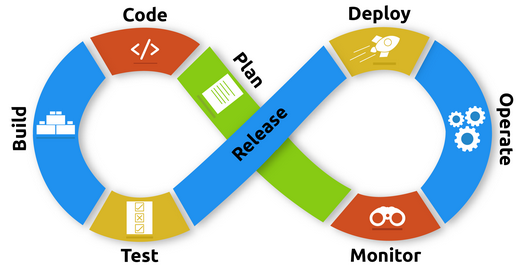
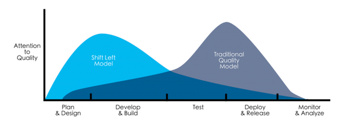

## What is Devops?
DevOps is a software development approach that combines software development (Dev) and IT operations (Ops) to improve collaboration and efficiency throughout the software development lifecycle (SDLC). It focuses on breaking down the traditional silos between development teams and operations teams, promoting a culture of collaboration, automation, and continuous delivery.
 
 
The goal of DevOps is to enable organizations to deliver software applications and services more quickly, reliably, and at scale. By fostering close collaboration between development, operations, and other stakeholders, DevOps aims to streamline the entire software delivery process, from code development and testing to deployment, monitoring, and maintenance.
 
DevOps emphasizes the following key principles:

1. Culture: DevOps emphasizes a collaborative culture where development and operations teams work together effectively, share responsibilities, and have a common understanding of the business objectives.

2. Automation: Automation plays a crucial role in DevOps, enabling the repetitive and manual tasks to be automated, such as building, testing, and deploying software, resulting in faster and more reliable processes.

3. Continuous Integration and Continuous Delivery (CI/CD): CI/CD is a set of practices that involve frequently integrating code changes, running automated tests, and deploying applications to production environments in an automated and reliable manner. This allows for faster and more incremental delivery of software updates.

4. Infrastructure as Code (IaC): Infrastructure as Code is the practice of managing and provisioning infrastructure resources (e.g., servers, networks, storage) through machine-readable configuration files. It allows for consistent, repeatable, and version-controlled infrastructure deployments, reducing manual errors and enabling infrastructure scalability.

5. Monitoring and Feedback: DevOps promotes the use of monitoring tools and practices to gather feedback on application performance, user experience, and other key metrics. This feedback loop helps identify issues, track performance, and drive continuous improvement.

By embracing DevOps principles and adopting appropriate tools and practices, organizations can achieve benefits such as faster time to market, improved quality and stability of software releases, increased collaboration and communication, enhanced scalability and reliability, and greater customer satisfaction.

---

## DevOps Stages?
DevOps implementation typically involves several stages or phases. While the exact terminology and order of these stages may vary depending on the source, here is a commonly used set of DevOps stages:

1. Plan: In this stage, teams define project goals, plan the required features and functionality, and determine the resources and timelines. It involves collaboration between development, operations, and other stakeholders to align the project objectives.

2. Develop: The development stage involves writing, testing, and reviewing code. Agile methodologies like Scrum or Kanban are often used to facilitate iterative and incremental development. Version control systems (VCS) and code review practices help ensure code quality and collaboration.

3. Build: The build stage involves compiling the code, packaging it, and creating deployable artifacts. Build tools, such as Apache Maven or Gradle, are used to automate the compilation and packaging process. Continuous Integration (CI) practices ensure that code changes are integrated and tested frequently.

4. Test: In the testing stage, various types of testing, such as unit testing, integration testing, and performance testing, are performed. Test automation tools and frameworks, such as Selenium or JUnit, help automate and streamline the testing process. Continuous Testing practices aim to identify and fix issues early in the development cycle.

5. Deploy: The deployment stage involves moving the software artifacts to the target environment, whether it's a test environment, staging environment, or production environment. Deployment tools and practices, such as containerization with Docker or infrastructure orchestration with Kubernetes, enable consistent and automated deployments.

6. Operate: Once the software is deployed, the operate stage focuses on managing and monitoring the application in the production environment. Monitoring tools and practices, such as log aggregation, metrics collection, and incident management, help ensure the application's availability, performance, and reliability.

7. Monitor: The monitor stage involves continuously collecting and analyzing data on application performance, user behavior, and system health. This feedback loop helps identify issues, track key metrics, and make data-driven decisions for optimizing the application and infrastructure.

8. Feedback: Throughout the entire DevOps lifecycle, feedback is crucial. Feedback from monitoring, user feedback, and performance metrics helps drive continuous improvement, identify areas for enhancement, and inform the planning and development of subsequent iterations.

It's important to note that DevOps is an iterative and continuous process, and these stages are interconnected. DevOps promotes the integration of development and operations activities throughout the software delivery pipeline, fostering collaboration, automation, and feedback loops to drive efficiency and quality in software development and operations.

---

## What Exactly Continuous Integration (CI) is?
Continuous Integration (CI) is a software development practice that involves merging code changes from multiple developers into a shared repository frequently. The primary goal of CI is to automate the process of building, testing, and validating these code changes to identify integration issues as early as possible. By integrating changes frequently, CI aims to reduce the risks associated with merging code and ensure that the application remains in a releasable state at all times.

CI typically involves the following key principles:

- Source Code Management: Developers work on isolated branches, and their changes are merged into a central repository, often using a version control system like Git.

- Automated Build: The CI server automatically compiles the code, fetches dependencies, and creates a deployable artifact.

- Automated Testing: A suite of automated tests, including unit tests, integration tests, and other forms of testing, is executed to verify the correctness of the code changes.

- Early Feedback: CI provides immediate feedback on the success or failure of the build and tests, allowing developers to address issues promptly.

- Continuous Inspection: Code quality checks, code coverage analysis, and other static analysis tools are employed to maintain code health.

- Deployment Readiness: The CI pipeline ensures that the application is ready for deployment by validating its readiness against predefined criteria.

 
 

## What Exactly Continuous Delivery (CD) is?
Continuous Delivery (CD) is an extension of Continuous Integration (CI) that focuses on automating the entire software release process, from code changes to deployment. It aims to enable frequent and reliable software releases, ensuring that software can be deployed to production at any given time with minimal manual effort.
 

The key principles of Continuous Delivery include:

- Automated Deployment Pipeline: CD utilizes a deployment pipeline, which is a sequence of automated stages that build, test, and deploy the application. Each stage in the pipeline represents a specific environment or set of activities, such as integration testing, user acceptance testing (UAT), and production deployment.

- Configuration Management: The application's configuration, environment dependencies, and infrastructure provisioning are managed in a consistent and automated manner using tools like Infrastructure as Code (IaC), such as Terraform or AWS CloudFormation.

- Deployment Automation: CD leverages automation tools to deploy the application to various environments, ensuring consistent and reproducible deployments. This includes deploying to different cloud platforms, container orchestration frameworks, or traditional infrastructure.

- Continuous Testing: CD emphasizes the importance of extensive automated testing at each stage of the deployment pipeline, including functional, performance, security, and other types of testing. This ensures that the application remains in a releasable state and minimizes the risk of introducing regressions.

- Release Orchestration: CD includes release management practices that help coordinate and manage releases across different environments, enabling controlled and auditable deployments.

- Incremental Feature Releases: CD promotes the ability to release small and incremental changes to production, allowing for faster feedback and reducing the time between development and customer usage.

---

## Shifting Left (DevSecOps)
Security can now be easily integrated because of the visibility and flexibility that DevOps introduces. You might have heard of the concept "Shifting Left." This means that  DevOps teams focus on applying security from the earliest stages in the development lifecycle and introducing a more collaborative culture between development and security.

In the past, security testing was implemented at the end of the development cycle. As the industry evolved and security functions were introduced, security teams would perform various analyses and security testing in the final stages of the lifecycle. Depending on the results of security testing, it would either permit the application to proceed for deployment into production or reject the application and pass it back to developers for remediating the flaws identified. This resulted in long delays in development and friction between teams.

Implementing security measures during all stages of the development lifecycle (shifting left) rather than at the end of the cycle will ensure the software is designed with security best practices built in. By detecting security flaws early in development, remediation costs are lower, and there would be no need to roll back changes as they are being addressed on time. This reduces cost, builds trust, and improves the security and quality of the product.

Since security can now be introduced early, risks are reduced massively. In the past, you would find out about security flaws and bugs at the very late stages, even in production. They are leading to stress, rollbacks, and economic losses. Integrating code analysis tools and automated tests earlier in the process can now identify these security flaws during early development.

This development approach to shifting left in DevOps can be referred to as **DevSecOps**.

With DevOps, security gets to be introduced early in the development cycle and this minimizes risks massively. Integrating code analysis tools and automated tests earlier in the process can lead to better identification and elimination of security loopholes. And as the software gets to the deployment stage, everything works smoothly as anticipated. Security is not an add-on. It's a must-have design feature. Blending security in DevOps would enhance the impact of DevOps and eliminate a lot of other bottlenecks that could arise otherwise. With a rise in the frequency of cyber threats and tightening regulations, adding security to DevOps is not a choice now but indeed an obligation.

### DevSecOps
DevSecOps is an approach that relies heavily on automation and platform design that integrates security as a shared responsibility. It means all members will be accountable for security impelementations and create a platform that test and analysises are run automatically.

DevSecOps should aim to bridge the security knowledge gaps between teams; for everyone to think and be accountable for security, they first need the tools and knowledge to drive this autonomy efficiently and confidently. 