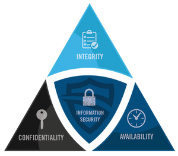
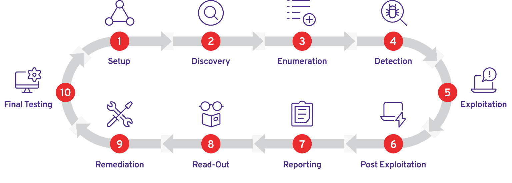

## What is Penetration Testing?
Penetration testing, often abbreviated as "pen testing," is a proactive cybersecurity practice in which authorized security professionals simulate cyberattacks on a computer system, network, application, or organization to identify vulnerabilities and weaknesses. The primary goal of penetration testing is to find and address security issues before malicious hackers can exploit them. Here's a breakdown of key points:

1. Authorized Testing: Penetration testing is conducted by cybersecurity experts who have explicit permission from the organization or system owner to perform these assessments. This ensures that the testing is legal and ethical.

2. Simulated Attacks: Pen testers use various techniques and tools to mimic the tactics that real hackers might employ to compromise systems. They attempt to breach security defenses, gain unauthorized access, and collect data or evidence of the vulnerabilities they discover.

3. Identification of Vulnerabilities: During the testing process, vulnerabilities, weaknesses, and misconfigurations are identified. These can include software bugs, weak passwords, outdated software, or insecure network configurations.

4. Reporting: Penetration testers document their findings in a detailed report. This report includes a list of vulnerabilities, their potential impact, and recommendations for remediation. It provides valuable insights for the organization to prioritize and address security issues.

5. Risk Mitigation: The organization can use the penetration test results to prioritize and implement security measures to mitigate the identified risks. This might involve patching software, improving network configurations, enhancing access controls, or educating employees about security best practices.

6. Types of Penetration Tests: There are various types of penetration tests, including black-box (where testers have minimal information), white-box (where testers have detailed information), and gray-box (a combination of both). Tests can focus on specific areas like web applications, network infrastructure, or social engineering.

---

## Simple Terminologies
- Threat: A threat is anything that has the potential to cause harm to your computer systems, networks, or data. Threats can be human (e.g., hackers), natural (e.g., floods), or technological (e.g., malware). Understanding threats is crucial in cybersecurity to identify potential vulnerabilities.

- Assets: Assets are the valuable resources within an organization that you want to protect. These can include data (e.g., customer information, intellectual property), hardware (e.g., servers, computers), software, and even the reputation of the organization. In penetration testing, you want to assess the security of these assets to prevent unauthorized access or damage.

- Risk: Risk is the likelihood and potential impact of a threat exploiting a vulnerability and causing harm to your assets. It's a combination of the probability of an event happening and the consequences if it does. Penetration testing helps identify and mitigate these risks by identifying vulnerabilities and recommending countermeasures to reduce the chances of a security breach.

- Vulnerability: A vulnerability is a weakness or flaw in a computer system, software, or network that could be exploited by attackers. It's like a hole in the defense that hackers can use to gain unauthorized access or perform malicious actions.

- Exploit: An exploit is a piece of code or a technique that takes advantage of a vulnerability to compromise a system or gain unauthorized access. It's like using a key to unlock a door with a weak lock.

- Payload: A payload is a piece of code or data that an attacker delivers to a target system after successfully exploiting a vulnerability. It's like the malicious cargo carried by a successful exploit, which can perform various actions, such as taking control of the system or stealing data.

- 0-Day (Zero-Day): A 0-day, short for "zero-day exploit" or "zero-day vulnerability," refers to a vulnerability in software or hardware that is not yet known to the vendor or the public. It's called "zero-day" because there are zero days of protection against it; it's unpatched and can be exploited immediately upon discovery. Hackers often seek and trade 0-day exploits as they are highly valuable for conducting cyberattacks.

---

## Confidentiality, Integrity and Availability (CIA) Traid
The Confidentiality, Integrity, and Availability (CIA) triad is a fundamental concept in cybersecurity that helps us understand the key goals of protecting information and computer systems:

- Confidentiality: This means keeping information secret and ensuring that only authorized people or systems can access it. Think of it like a locked diary that only you and trusted individuals can read. Example: Protecting sensitive customer data from being accessed by unauthorized employees or hackers.

- Integrity: Integrity ensures the accuracy and reliability of data. It means that data should not be tampered with or altered by unauthorized users or processes. Imagine a sealed envelope; if it's opened or tampered with, you'll know it's been compromised. Example: Ensuring that financial records remain unchanged and accurate, so there are no unauthorized changes to transactions.

- Availability: Availability ensures that data and systems are available and accessible when needed. It's like having your car ready to go when you want to drive; you don't want it to be unavailable due to maintenance or other issues. Example: Ensuring that a critical business application is always accessible to employees, customers, or partners, so it doesn't disrupt operations.

---

## Penetration Testing Phases
Penetration testing typically consists of several well-defined phases to ensure a structured and thorough assessment of an organization's security. These phases help penetration testers systematically identify vulnerabilities and weaknesses. The common phases of penetration testing are as follows:

- Preparation: In this initial phase, the penetration testing team collaborates with the organization's stakeholders to define the scope, objectives, and rules of engagement for the test. This involves understanding the target systems, applications, and potential impact on the organization. Contracts, legal agreements, and permissions are also established during this phase.

- Reconnaissance (Information Gathering): During this phase, testers gather information about the target environment, such as IP addresses, domain names, email addresses, and public information about the organization. This information helps testers understand the attack surface and potential entry points.

- Enumeration and Scanning: Testers actively scan the target systems and networks to identify open ports, services, and potential vulnerabilities. They may use tools like port scanners, service enumerators, and network mappers to collect data about the systems they plan to assess.

- Vulnerability Analysis: In this phase, testers analyze the collected data to identify vulnerabilities and weaknesses in the target systems and applications. Vulnerabilities can include software bugs, misconfigurations, weak passwords, or other security issues.

- Exploitation: Once vulnerabilities are identified, testers attempt to exploit them to gain unauthorized access or control over the target systems. They use techniques and tools to simulate real-world attacks, demonstrating how an attacker might compromise the systems.

- Post-Exploitation: After gaining access to a system, testers assess the extent of the compromise. They may aim to escalate privileges, maintain persistence, and exfiltrate sensitive data if that's within the scope of the engagement. This phase helps the organization understand the potential impact of a successful attack.

- Reporting: Testers compile their findings into a detailed report, including a list of vulnerabilities, their severity, potential risks, and recommendations for remediation. The report is shared with the organization's stakeholders, who can then prioritize and address security issues.

- Cleanup and Remediation: After the testing is complete, the organization should address the identified vulnerabilities and weaknesses promptly. This may involve patching software, updating configurations, enhancing access controls, and improving security policies and procedures.

- Verification: In some cases, a verification phase may be conducted to ensure that the reported vulnerabilities have been properly remediated. Testers retest the systems to confirm that the identified issues have been addressed effectively.

- Documentation and Knowledge Transfer: Finally, the penetration testing team documents their entire testing process, including the tools used, methodologies applied, and lessons learned. Knowledge transfer may occur to ensure that the organization can benefit from the insights gained during the test for future security enhancements.

---

## What Are Penetration Testing Methodologies?
Penetration testing methodologies are structured approaches and frameworks that guide penetration testers (ethical hackers) through the process of systematically assessing the security of an organization's systems, networks, and applications. These methodologies provide a step-by-step plan for conducting penetration tests to identify vulnerabilities and weaknesses effectively. Several widely recognized penetration testing methodologies include:

- Open Web Application Security Project (OWASP) Testing Guide: OWASP is a nonprofit organization focused on improving the security of software. Their Testing Guide provides a comprehensive framework for testing web applications and web services. It covers areas such as authentication, authorization, input validation, and more.

- Penetration Testing Execution Standard (PTES): PTES is a globally recognized standard that defines a comprehensive methodology for conducting penetration tests. It breaks down the testing process into seven stages: Pre-engagement, Intelligence Gathering, Threat Modeling, Vulnerability Analysis, Exploitation, Post Exploitation, and Reporting.

- Information Systems Security Assessment Framework (ISSAF): ISSAF is a methodology specifically designed for assessing the security of information systems. It covers areas like network security, application security, and physical security. ISSAF provides a detailed guide for each phase of the assessment.

- NIST Special Publication 800-115: Published by the National Institute of Standards and Technology (NIST), this document provides guidance on conducting penetration testing within federal systems and organizations. It outlines key phases, methods, and considerations for penetration testing.

- OSSTMM (Open Source Security Testing Methodology Manual): OSSTMM is an open-source methodology that emphasizes a metrics-based approach to security testing. It focuses on gathering quantifiable data about the security of systems and networks.

- Red Team vs. Blue Team (RTBT): This methodology simulates a "red team" (attackers) attempting to breach an organization's defenses, while a "blue team" (defenders) defends against the attacks. It is often used in military and government contexts to assess and enhance security preparedness.

- Custom Methodologies: Many penetration testers and organizations develop their custom methodologies tailored to their specific needs and objectives. These may combine elements from various existing methodologies or introduce unique approaches.