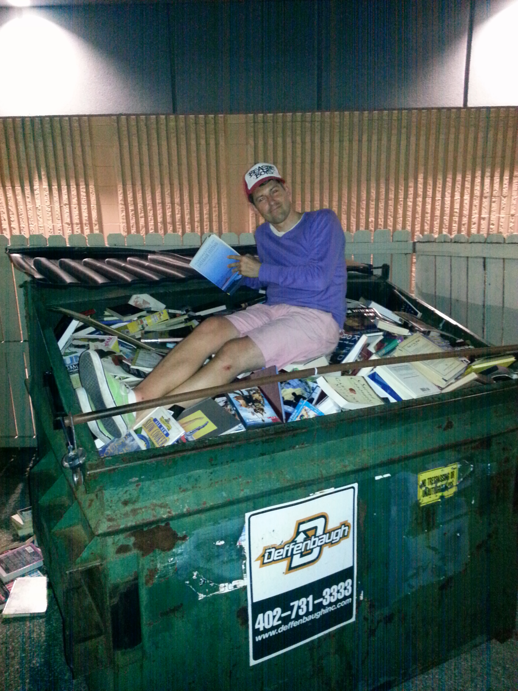

# Dumpster Diving
 When you first became interested in IT security, were you ever thinking that you might spend your time inside of a garbage bin looking through pieces of personal information? This is the concept of the Dumpster Diving and its is a very valid way to gather important details from things that people have thrown out in their trash. 
 
 
 
 An attacker has to do is wait until you take out the trash and they'll simply pick it up and take it with them.
 
 ---
 ### Protect your rubbish
 To be able to prevent someone else from gaining access to your personal details, you want make sure that your particular garbage area is locked up and secured, especially if you're in a large organization. Another great way to prevent somebody from reading your documents is to cut your documents up into very small pieces. And in some very high-security organizations they will simply burn all of this information to make sure that you could not put it all back together again.
 - Fence and a lock
 - Shred your documents
 - Burn them