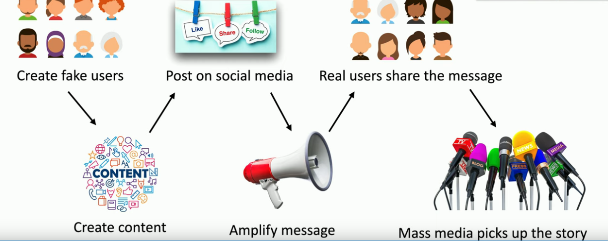
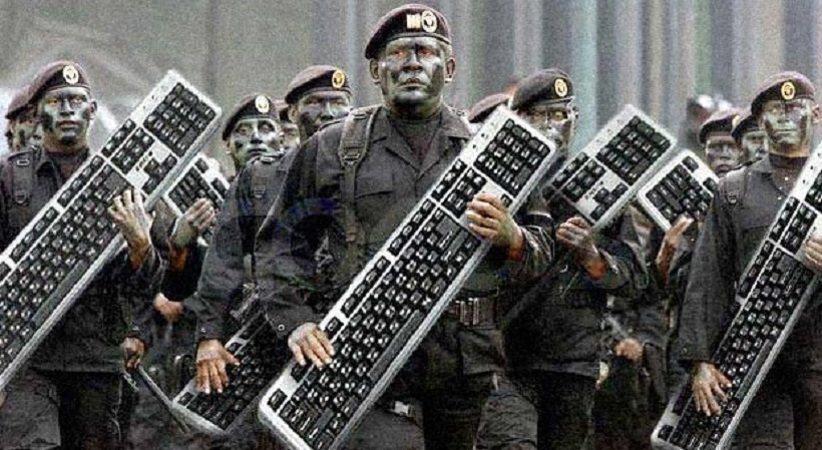

# Influence Campaigns
The advent of social media has dramatically changed the way the public opinion can be swayed. This might be a completely legitimate person who's trying to present a particular political perspective or a social issue, but this might also be someone trying to manipulate how people are thinking in a particular area.

This is very commonly an attacker from a nation-state that is trying to change the way that people are voting and the way that people are thinking in a particular country.

Sometimes these bad actors will spend a lot of money on advertising as a way to change the opinion of people who may be reading thing online. Some of the most powerful influence campaigns use more than just a single person posting on social media. They use an entire system to amplify that message and get it into the eyes and the ears of many people. 

---
### The influencing process
- This process usually starts by the bad actor creating a number of fake accounts. These are users that don't really exist, but online they appear to be real people.
- These fake users now starting creating content, and they start posting this content on many different sites. So you could be on LinkedIn, Twitter, Facebook and many other places online and start to see the content that is being created by these individuals users.
- By putting this message in many different places online it amplifies the effect and the scope of who's able to read these messages.
- And once real people start to see this content, they start sharing it to other people that they know.
- And then mass media will pick up this story because they notice that many people are talking about this and mass media wants to be read as well.

Now all of these now work together to start from what was a completely fake user suddenly having a message appear on the standard media that we tend to trust day-to-day

---
These influence campaigns can also have a military reason for existing. You might have one county that is trying to change the way that people are thinking in another country. And if people change that way they're thinking then they'll ask their elected officials to vote on particular policies in particular way. This is not a new process militaries all over the world have tried to make this happen in differnet countries. **We often refer to this type of warfare as Cyber warefare.** Militaries that use these techniques are able to influence elections, they're able to change the type of news that we receive and it changes ho these particular countries are able to interact with other countries around the world.
