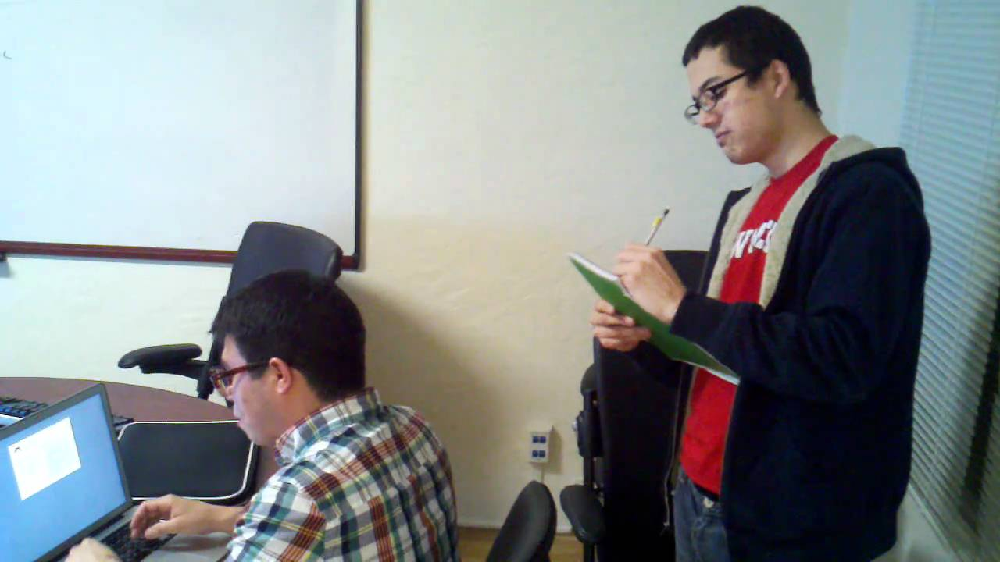

# Shoulder Surfing 
The thing that you have on your computer might be important ex: spreadsheets, documents, presentations and things that you do in your day to day job and you may not even realize just how important that information might be for someone else to be able to gain access to.

** Well one of the ways that they are able to gather this details is by simply looking over your shoulder. This is called Shoulder Surfing** and it's very common way for people to obtain password information and details about documents that you might be viewing on your computer.

for example in airports or flights, in coffee shops you can find people with laptop that are working on what is very obviously sensitive and private information and it is easy to see what is going on because you might be directly behind them or beside them.

You also can even do this from the next building over if you have binoculars or a telescope and you can see what happens to be on someone's screen even though you're not at the same room or even the same building as that person.

---
### Preventing Shoulder Surfing
- Be aware of your surroundings 
- Use privacy filters ( something that completely blacks the screen unless you're the person who's sitting directly in from of the computer.)
- Keep your monitor out of sight (ex : away from windows or hallways...)