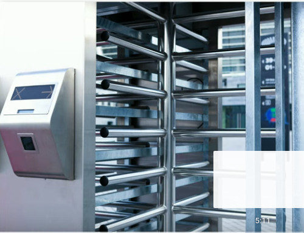

# TailGating
If you work in an office where you badge-in to unlock a door to gain access to the inside then you've probably been told to prevent someone from tailgating. 
**Tailgating is when an unauthorized individual might follow you in through that open door without badging in themselves.** 

They are blending in and they seem to have a legitimate reason for being inside, and someone might hold the door open to allow someone in to fix the telephone system for example. Sometimes those individuals will sit in the smoking section pretending that they are on break and the they'll simply follow another smoker back into the building, saying that it's time to get back to work. It is often that attacker follow inside by having their hands full of food or treats and making sure that someone make that door open so they're allowed in with all of this food.

---
# Watching for tailgating
Most organizations will have a policy for visitors, You're give a visitor badge, It's very clear that you're allowed into the building as long as you have someone with you who is a member of that organization.

You often see signs next to the locked door that say, no tailgating or one scan on person to remind people not to allow others to walk through behind them.

Some organization will have an access control vestibule or some other type of process that would only allow one person at a time.

