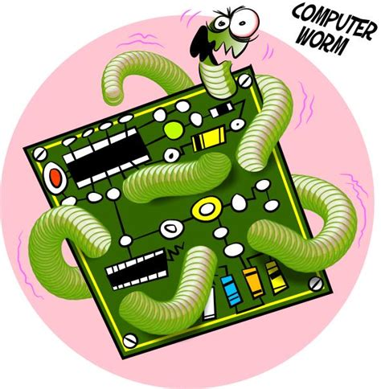

# Worms
As previously mentioned a traditional Virus require an end user to click on an executable and start the process, **but a type of virus that dose not need nay type of user intervention is a worm.** A worm takes advantage of a vulnerability in operating systems or applications to be able to move itself form system to system without requiring any type of user intervention. Worm take advantage of the connectivity we have on our local network and our internet-connected systems to be able to move very quickly and very easily from computer to computer.

These worms are so good at propagating themselves that is not unusual for hundreds of thousands or even millions of systems to be infected in very short period of time. 

Once the worm has been identified and a signature has being created we can usually stop the propagation of the worm at the firewall of the IDS/IPS(intrusion detection system/ intrusion prevention system). This obviously requires that we know the worm exists and that we can create a signature for it and it also requires that you are able  to put a firewall or an IPS in place between two systems so that you can block that flow of communication.