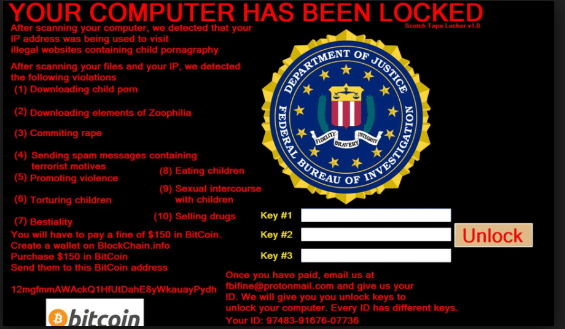
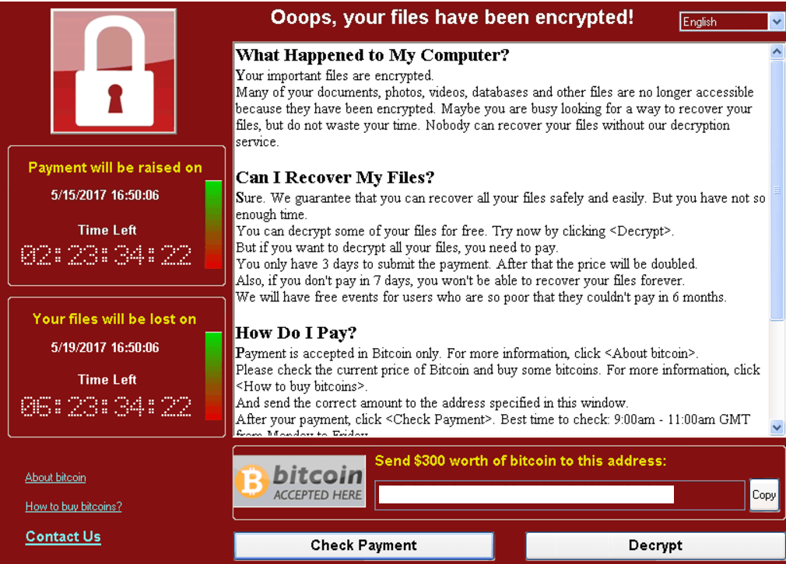

# Ransomware_and_Crypto-malware

Very often, the most valuable thing we own is our data. This may be documents that we keep stored on our computer or family videos or photos that can not be replaced. The data owned by a company is even more valuable. This  might include planning documents of the company, employee personally identifiable information(PII), financial information or proprietary and private data that only the company would have. 

with all of  this valuable data on our systems, what if all of it suddenly disappeared? How much would you pay to get all of that data back? There is a number and the attackers know that you will be willing to give them money if they could restore access to your files.

---
### Ransomware 
**This method of taking away your data and requiring you to pay to get that data back is called Ransomware.** This is a very popular way that the attackers are starting to make a lot of money by embedding malware on your system and requiring you to send them Bitcoin or some other kind of payment. 

Early forms of ransomware were not even real. They were hoaxes (fake). In some cases a security professional may be able to remove this malware and you would gain access to the system again.

---
### Crypto-malware 
**The attackers realized very quickly that having a hoax as part of the ransomware was not good enough. they really needed a way to lock your personal files and your private information, so they created a new form of ransomware called crypto-malware (so it is newer generation of ransomware) . Crypto-malware uses cryptography to be able to encrypt all of your personal information and make it that none of that information can be decrypted unless you have the proper key. ** The way that you obtain that key is that you send the attackers money or Bitcoin and they will send you the key that will then decrypt all of your personal information.

---
### Protecting against ransomware
- There are some relatively simple ways to protect yourself against ransomware. One of the most obvious ones is to always have a good backup and this needs to be backup that is not an online backup or an immediately accessible backup from your computer. That is because ransomware looks at all of the things connected to your computer and if they find a backup, they will also encrypt the backup that you have created. 

- keep your operation system up-to-data and always maintain the security patches on your system so that all of those known vulnerabilities are not available to ransomware. The same thing applies to the applications that you run on your computer, to make sure there is no vulnerabilities with those.
- you want to be sure that your anti-malware or anti-virus software are always running the latest signatures. 

