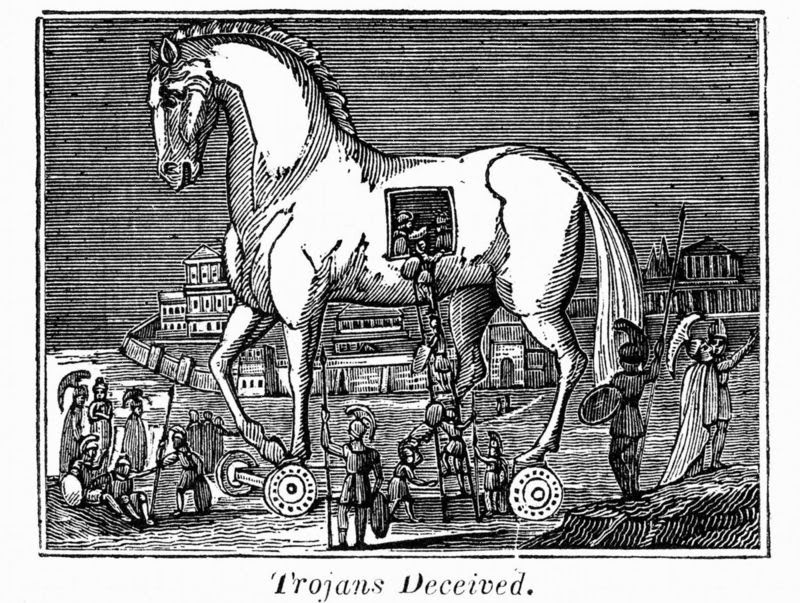
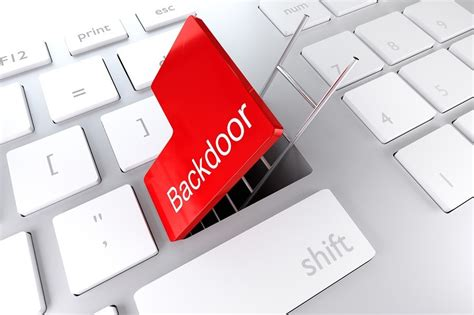
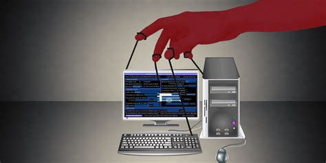

# Trojans and RATs
### Trojan Horse

**In history a Trojan horse was a large wooden horse that was used by Greeks to capture Troy from Trojans. In our computers there is a digital version of this Trojan horse used by attackers to be able to sneak their software onto your system. This Trojan horse software is software that pretends to be something else and it looks like software that is perfectly normal.** You may think your are installing a spreadsheet, an imaging editing program or a game But in reality you are installing malware that is only pretending to be that software.

Trojan horse software is not only designed to look innocuous to you,  it is also designed to look non-threatening to your antivirus software. And very commonly Trojan horse software can get onto your system, disable all your security tools and then have free reign of your computer. 

Now that the Trojan horse is running it can configure back doors or download additional malware to install on your system.

---
## Potentially Unwanted Program (PUP)
**One type of software that is commonly downloaded by this Trojan horse software is PUP. This is a potentially unwanted program. This may not be malicious software, but it could be undesirable and may cause performance problems on your computer.** For example it might install a browser toolbar that becomes very difficult to uninstall or remove from your browser or it may be a backup utility that constantly shows advertising even when it is not backing up. Or it might be software that hijacks you browser and every time you want to search something in google it redirect you to a different search engine.

---
## Backdoors

We mentioned earlier that **when malware finds itself a way to run on your computer, one of the things that it tends to do is to open up a back door on your system. That is because it is really difficult to find vulnerabilities and to get users to click on these links.** And once malware is running it wants to find a way to easily reconnect to your system later on without having to go through that very difficult process again. To be able to do that, it starts up new software on your computer that opens a back door. 

This would be very similar to the back door of your house. The malware simply creates a new way to get into your system	without having to go through the front door. 

What is interesting about some of these back doors is that the same backdoor process can be used by multiple types of malware. So once one type of malware gets onto your system, other types of malware are able to get into and infect your computer through that same back door that was created originally.

You might even find that software or hardware that you thought was secure may also include a backdoor into its code. For example, very old versions of Linux had a back door that was build into the kernel. And you might also find that applications and other equipment that is connected to your network might inadvertently include back doors as part of the software that is running on those systems.

---
## Remote Access Trojans (RATs)

**A type of software that attackers might install as part of the back-door is a Remote Access Trojan or a RAT. You might also hear this referred to as Remote Administration Tool.** This is a remote access tool that gives third party access to your computer to have nearly complete control over the operating system the malware that gets installed onto a computer might install this Remote Access Trojan and from that point on, the third party is able to access your computer remotely and controlling many aspects  of what the operating system is doing. It can collect a log of all the keys you press, including your usernames and passwords. It might record the screen or take screenshots and transfer those back to the attacker. It can copy files, either from your computer or to your computer and of course it can then run and embed more malware on your system.

---
## Protecting against Trojans and RATs
The process of preventing a Trojan or RAT from running on your system is very similar to preventing any other type of malware:
- you don't want to click any unknown links or links inside of your emails. 
- You always want to be sure that your antivirus software is running and that you have the latest signatures installed for that software. 
- It is always to have a backup so that if a system does become infected and you are not able to remove that software, you can easily restore your system from that known good backup.