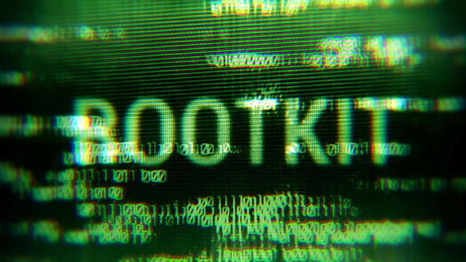

# ROOTKITS
The term "rootkit" has a foundation in  Unix or Linux where root is the administrative account on that particular system. But rootkits can be found on any operating system, like windows, linux, max os or anything else.**A common characteristic of a rootkit is instead of modifying files in your operating system it is modifying files in the kernel of the operating system. (so modifies core system files that are part of the kernel)** These are the foundational building blocks of the operating system. And everything that runs in the OS runs on top of that kernel.

**Because this malware now becomes part of the operating system itself, it effectively becomes invisible to antivirus and anti-malware software (the traditional antivirus that most people uses) and that is one of the reasons why identifying and removing a rootkit from a system can be a very difficult process.(if you can not see it you can not stop it)**

## Kernel drivers
Malware authors were starting to combine rootkit functionality with their malware functionality to create a botnet that would be very difficult to remove from a system. 

A good example of malware that was starting to combine a rootkit with the malware itself was the "Zeus" or the "Zbot" malware. This was malware very good at transferring money out of victim back account into the back account of the malware author. They combined the Zeus malware with the "Necurs" rootkit. This created a type of malware that one it was installed, it made it almost impossible to delete it from your system. Any time you would try to delete the files, the rootkit would be part of the operating system and would prevent you from deleting any part of the botnet malware. If you tried to stop the Windows process the malware was using the access would also be denied. Anything that you tried to do to stop that malware from running, would be stopped by the underlying rootkit in the operating system.

## Find and removing rootkits
There are some anti-malware and antivirus software that can look for and identify rootkits that may be running on the system. And there are specific rootkit removers that are designed to remove specific variants or specific types of rootkits.

**Fortunately we have create new types of BIOS software such as the UEFI BIOS that includes a feature called secure boot. This secure boot feature will look to see if any part of the kernel has been changed and would not boot a system that may have been modified thereby preventing rootkits from being installed on our modern systems.**