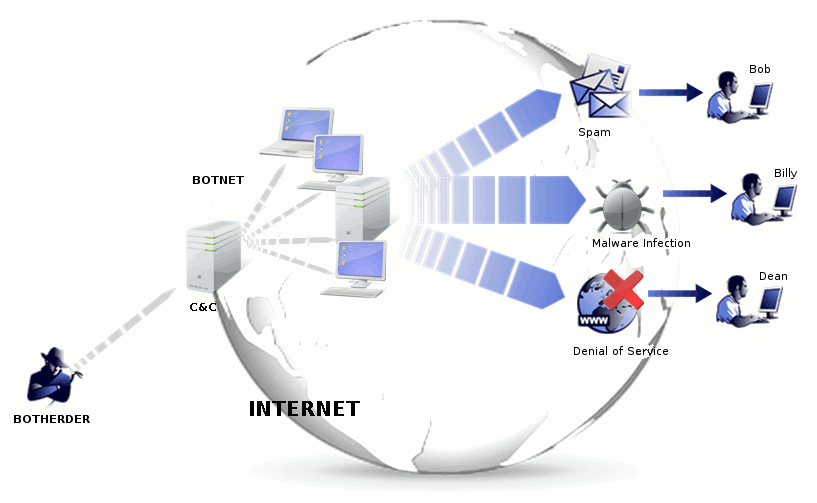

# Bots and Botnets
 **The malware term "bot" stands for robot and it is a term to describe the automation that occurs behind the scenes when your system is taken over by this type of malware.**
 
 Once it gets on your computer it can control almost any aspect of your operating system. This type of software is installed in your system through a Trojan horse, through a vulnerability in an operating system or an application or alongside an application that you are installing normally. 
 
 **The bot malware on a computer is working along with other computers that are infected with the same bot-malware to create a botnet.**  This botnet is controlled through a **Command and Control** server (C&C server). The C&C server is responsible for sending out commands. Those commands will be received bu the botnet and then the botnet will perform whatever function has been asked of it by the C&C.
 
 
 As you can imagine all of these systems under the control of somebody nefarious, can create some significant problems. Having all of these systems work together can create a massive **Denial of Service** (DoC) and because it is so many different systems located in so many different places, it is** Distributed Denial of Service** (DDoS).
 
These systems can also act as proxies or relays for spam, network traffic and other types of tasks, and very large botnets can be rented out to third parties effectively creating a Distributed Denial of Service as a service.

If you would like a view of what botnets may be active anywhere in the world at any time, you can visit [here](https://map.lookingglasscyber.com/). On 'LookingGlass' site you can see the number of infections per second, live attacks, the number and type of botnets and the countries where those botnets are communicating.

## Stopping the bot
One way to stop a botnet is to make sure that is is not installed in the first place. So you want to be sure that your operating system and your applications are running the latest security patches and make sure that your antivirus and anti-malware software have all of the latest signatures.

You can also identify an active infection by scanning an on-demand anti-malware scan and watching the network for any unusual traffic patterns and if you know the type of network flows that will be used for the Command and Control you can block that at the firewall of with an IPS of firewall at the workstation level.